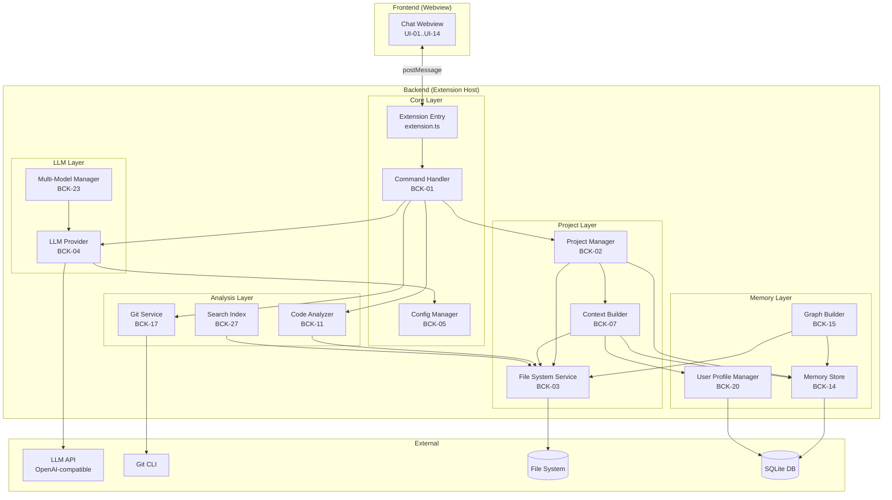
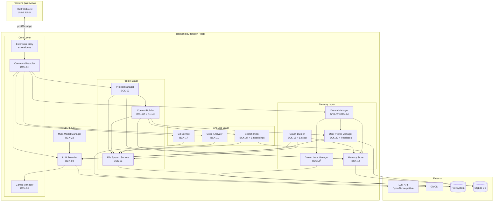

# Архитектура расширения Devil

## Обзор

Devil — это расширение VS Code, реализующее интеллектуального агента-ассистента для разработчиков с долговременной памятью. Архитектура построена по принципу **разделения ответственности** (Separation of Concerns) и состоит из 6 основных модулей.

## Диаграмма модулей



## Описание модулей

### 1. Core Layer (Ядро)

**Ответственность:** Точка входа, регистрация команд, управление конфигурацией.

#### Extension Entry (`extension.ts`)
- **Задача:** BCK-01
- **Файл:** `src/extension.ts`
- **Ответственность:**
  - Активация расширения
  - Регистрация команд (`devil.openChat`, `devil.openProject`, `/explain`, `/roadmap`, и т.д.)
  - Инициализация сервисов
  - Освобождение ресурсов при деактивации

#### Command Handler
- **Задача:** BCK-01
- **Файл:** `src/commands/CommandHandler.ts`
- **Ответственность:**
  - Маршрутизация команд из чата
  - Парсинг аргументов команд (`/explain file.ts`, `/whereis App`)
  - Вызов соответствующих сервисов
  - Возврат результатов в Webview

#### Config Manager
- **Задача:** BCK-05
- **Файл:** `src/services/ConfigManager.ts`
- **Ответственность:**
  - Чтение настроек из `vscode.workspace.getConfiguration('devil')`
  - Управление `baseUrl`, `apiKey`, `model`, `maxRetries`
  - Подписка на изменения настроек
  - Валидация конфигурации

**Ключевые методы:**
```typescript
class ConfigManager {
  getBaseUrl(): string;
  getApiKey(): string;
  getModel(): string;
  getMaxRetries(): number;
  onConfigChanged(callback: () => void): void;
}
```

---

### 2. Project Layer (Управление проектом)

**Ответственность:** Управление текущим проектом, сканирование файловой системы, построение контекста.

#### Project Manager
- **Задача:** BCK-02
- **Файл:** `src/services/ProjectManager.ts`
- **Ответственность:**
  - Хранение текущего `workspaceFolder`
  - Управление путём к `.devil/`
  - Сканирование структуры проекта
  - Отслеживание изменений через `FileSystemWatcher`

**Ключевые методы:**
```typescript
class ProjectManager {
  getCurrentProject(): ProjectInfo;
  setProject(folder: vscode.WorkspaceFolder): void;
  getProjectStructure(): FileTree;
  getDevilPath(): string;
  onFileChanged(callback: (event: FileChangeEvent) => void): void;
}

interface ProjectInfo {
  name: string;
  path: string;
  devilPath: string;
  fileCount: number;
}
```

#### File System Service
- **Задача:** BCK-03
- **Файл:** `src/services/FileSystemService.ts`
- **Ответственность:**
  - Чтение/запись файлов
  - Сканирование директорий (рекурсивное)
  - Исключение `.git`, `node_modules`, `out`, `backups`
  - Построение дерева файлов

**Ключевые методы:**
```typescript
class FileSystemService {
  readFile(path: string): Promise<string>;
  writeFile(path: string, content: string): Promise<void>;
  scanDirectory(rootPath: string, options?: ScanOptions): Promise<FileTree>;
  fileExists(path: string): Promise<boolean>;
}

interface ScanOptions {
  excludePatterns?: string[];
  maxDepth?: number;
  includeContent?: boolean;
}

interface FileTree {
  name: string;
  path: string;
  type: 'file' | 'directory';
  children?: FileTree[];
  content?: string;
}
```

#### Context Builder
- **Задача:** BCK-07
- **Файл:** `src/services/ContextBuilder.ts`
- **Ответственность:**
  - Формирование системного промпта для LLM
  - Включение структуры проекта, Roadmap, чек-листа
  - Добавление информации из графовой памяти
  - Включение профиля пользователя

**Ключевые методы:**
```typescript
class ContextBuilder {
  buildContext(query: string, project: ProjectInfo): Promise<string>;
  includeProjectStructure(include: boolean): void;
  includeRoadmap(include: boolean): void;
  includeMemoryGraph(include: boolean): void;
  includeUserProfile(include: boolean): void;
}
```

---

### 3. LLM Layer (Работа с LLM)

**Ответственность:** Абстракция над LLM API, управление моделями, повторные попытки.

#### LLM Provider
- **Задача:** BCK-04
- **Файл:** `src/services/LLMProvider.ts`
- **Ответственность:**
  - Отправка запросов к LLM API (OpenAI-совместимый)
  - Обработка ответов (streaming, non-streaming)
  - Повторные попытки при ошибках
  - Логирование запросов/ответов

**Ключевые методы:**
```typescript
class LLMProvider {
  generate(prompt: string, options?: GenerateOptions): Promise<LLMResponse>;
  generateStream(prompt: string, options?: GenerateOptions): AsyncIterable<string>;
  setModel(model: string): void;
  setBaseUrl(url: string): void;
  setApiKey(key: string): void;
}

interface GenerateOptions {
  temperature?: number;
  maxTokens?: number;
  systemPrompt?: string;
  stream?: boolean;
}

interface LLMResponse {
  content: string;
  model: string;
  tokensUsed: number;
  finishReason: string;
}
```

#### Multi-Model Manager
- **Задача:** BCK-23
- **Файл:** `src/services/MultiModelManager.ts`
- **Ответственность:**
  - Управление несколькими конфигурациями моделей
  - Переключение между моделями
  - Назначение моделей для разных задач (быстрая для чата, мощная для рефакторинга)

**Ключевые методы:**
```typescript
class MultiModelManager {
  getAvailableModels(): ModelConfig[];
  switchModel(modelId: string): void;
  getModelForTask(task: TaskType): string;
  addModel(config: ModelConfig): void;
}

interface ModelConfig {
  id: string;
  name: string;
  baseUrl: string;
  apiKey: string;
  model: string;
  taskTypes: TaskType[];
}

type TaskType = 'chat' | 'refactor' | 'generate' | 'explain';
```

---

### 4. Memory Layer (Память и обучение)

**Ответственность:** Графовая память, профиль пользователя, долговременное хранение.

#### Memory Store
- **Задача:** BCK-14
- **Файл:** `src/services/MemoryStore.ts`
- **Ответственность:**
  - Инициализация SQLite БД в `.devil/memory.db`
  - CRUD операции для узлов и связей графа
  - Поиск узлов по имени, типу, тегам
  - Поиск связей между узлами

**Ключевые методы:**
```typescript
class MemoryStore {
  initialize(dbPath: string): Promise<void>;
  close(): Promise<void>;

  // Nodes
  addNode(node: GraphNode): Promise<void>;
  getNode(id: string): Promise<GraphNode | null>;
  findNodes(query: NodeQuery): Promise<GraphNode[]>;
  updateNode(id: string, updates: Partial<GraphNode>): Promise<void>;
  deleteNode(id: string): Promise<void>;

  // Edges
  addEdge(edge: GraphEdge): Promise<void>;
  getEdgesFrom(nodeId: string): Promise<GraphEdge[]>;
  getEdgesTo(nodeId: string): Promise<GraphEdge[]>;
  deleteEdge(id: string): Promise<void>;
}

interface GraphNode {
  id: string;
  type: NodeType;
  name: string;
  path?: string;
  metadata?: Record<string, any>;
  tags?: string[];
  createdAt: number;
  updatedAt: number;
}

type NodeType = 'file' | 'class' | 'function' | 'variable' | 'technology' | 'decision' | 'concept';

interface GraphEdge {
  id: string;
  from: string;
  to: string;
  type: EdgeType;
  metadata?: Record<string, any>;
}

type EdgeType = 'imports' | 'calls' | 'uses' | 'depends_on' | 'implements' | 'extends' | 'contains';
```

#### Graph Builder
- **Задача:** BCK-15
- **Файл:** `src/services/GraphBuilder.ts`
- **Ответственность:**
  - Парсинг кода (Tree-sitter для TS/JS, RegExp для Python)
  - Извлечение сущностей (функции, классы, импорты)
  - Построение связей между сущностями
  - Инкрементальное обновление графа

**Ключевые методы:**
```typescript
class GraphBuilder {
  buildFromFile(filePath: string): Promise<GraphUpdate>;
  buildFromProject(projectPath: string): Promise<GraphUpdate>;
  updateForFile(filePath: string): Promise<GraphUpdate>;
  removeFile(filePath: string): Promise<void>;
}

interface GraphUpdate {
  addedNodes: GraphNode[];
  removedNodes: string[];
  addedEdges: GraphEdge[];
  removedEdges: string[];
}
```

#### User Profile Manager
- **Задача:** BCK-20
- **Файл:** `src/services/UserProfileManager.ts`
- **Ответственность:**
  - Хранение глобального профиля пользователя
  - Запись предпочтений (стиль кода, библиотеки, паттерны)
  - Обучение на истории взаимодействий
  - Чтение профиля для контекста LLM

**Ключевые методы:**
```typescript
class UserProfileManager {
  getProfile(): Promise<UserProfile>;
  updateProfile(updates: Partial<UserProfile>): Promise<void>;
  addPreference(key: string, value: any): Promise<void>;
  getPreferences(): Promise<Record<string, any>>;
}

interface UserProfile {
  codingStyle: {
    indentStyle: 'tabs' | 'spaces';
    indentSize: number;
    quoteStyle: 'single' | 'double';
    semicolons: boolean;
  };
  preferredLibraries: string[];
  preferredPatterns: string[];
  customInstructions: string[];
  interactionHistory: InteractionRecord[];
}
```

---

### 5. Analysis Layer (Анализ кода)

**Ответственность:** Анализ кода, Git-интеграция, поиск, линтинг.

#### Code Analyzer
- **Задача:** BCK-11
- **Файл:** `src/services/CodeAnalyzer.ts`
- **Ответственность:**
  - Объяснение кода на русском языке
  - Предложение рефакторинга
  - Анализ зависимостей
  - Поиск использования символов

**Ключевые методы:**
```typescript
class CodeAnalyzer {
  explainCode(code: string, filePath: string): Promise<string>;
  suggestRefactoring(code: string, filePath: string): Promise<RefactorSuggestion>;
  findUsages(symbol: string): Promise<UsageLocation[]>;
  analyzeDependencies(filePath: string): Promise<DependencyGraph>;
}

interface RefactorSuggestion {
  originalCode: string;
  refactoredCode: string;
  explanation: string;
  improvements: string[];
}

interface UsageLocation {
  filePath: string;
  line: number;
  column: number;
  context: string;
}
```

#### Git Service
- **Задача:** BCK-17
- **Файл:** `src/services/GitService.ts`
- **Ответственность:**
  - Чтение истории коммитов
  - Получение diff между коммитами
  - Анализ изменений файла
  - Интеграция через `child_process` (git CLI)

**Ключевые методы:**
```typescript
class GitService {
  getLog(filePath?: string, limit?: number): Promise<GitCommit[]>;
  getDiff(commitA: string, commitB: string): Promise<string>;
  getFileHistory(filePath: string): Promise<GitCommit[]>;
  getCurrentBranch(): Promise<string>;
}

interface GitCommit {
  hash: string;
  author: string;
  date: string;
  message: string;
  filesChanged: string[];
}
```

#### Search Index
- **Задача:** BCK-27
- **Файл:** `src/services/SearchIndex.ts`
- **Ответственность:**
  - Построение индекса по содержимому файлов
  - Полнотекстовый поиск
  - Семантический поиск (векторный)
  - Инкрементальное обновление индекса

**Ключевые методы:**
```typescript
class SearchIndex {
  buildIndex(projectPath: string): Promise<void>;
  searchText(query: string): Promise<SearchResult[]>;
  searchSemantic(query: string): Promise<SearchResult[]>;
  updateIndex(filePath: string): Promise<void>;
  removeFromIndex(filePath: string): Promise<void>;
}

interface SearchResult {
  filePath: string;
  line: number;
  content: string;
  score: number;
  highlights: string[];
}
```

---

### 6. Frontend Layer (Webview)

**Ответственность:** Чат-интерфейс, отображение результатов, взаимодействие с пользователем.

#### Chat Webview
- **Задача:** UI-01..UI-14
- **Файл:** `webview/chat.html`, `webview/chat.js`, `webview/chat.css`
- **Ответственность:**
  - Отображение истории сообщений
  - Поле ввода, кнопка отправки
  - Рендеринг Markdown (marked/markdown-it)
  - Подсветка синтаксиса (highlight.js)
  - Кнопки копирования кода
  - Обмен сообщениями с расширением (postMessage API)

**Поток данных:**
```typescript
// Webview → Extension
webview.postMessage({
  type: 'userMessage',
  content: '/explain src/extension.ts',
  id: 'msg_123'
});

// Extension → Webview
webview.postMessage({
  type: 'agentResponse',
  content: '## Объяснение\n\nФайл `extension.ts`...',
  id: 'msg_123',
  metadata: { tokensUsed: 150, model: 'gpt-4o-mini' }
});
```

---

## Потоки данных

### 1. Отправка сообщения в чат

```
User → Webview (postMessage: userMessage)
     → Extension (CommandHandler.handleMessage)
     → ContextBuilder.buildContext (добавляет структуру проекта, память)
     → LLMProvider.generate (отправляет запрос к LLM API)
     → LLM API (возвращает ответ)
     → CommandHandler (обрабатывает ответ)
     → Webview (postMessage: agentResponse)
     → User (видит ответ в чате)
```

### 2. Сканирование проекта и построение графа

```
User → Command: devil.openProject
     → ProjectManager.setProject
     → FileSystemService.scanDirectory
     → GraphBuilder.buildFromProject
       → Парсинг каждого файла (Tree-sitter/RegExp)
       → Извлечение сущностей (функции, классы, импорты)
       → MemoryStore.addNode / addEdge
     → ProjectManager.onFileChanged (подписка на изменения)
```

### 3. Команда /whereis [symbol]

```
User → Webview (postMessage: /whereis App)
     → CommandHandler.parseCommand
     → MemoryStore.findNodes({ name: 'App', type: 'class' })
     → MemoryStore.getEdgesTo(nodeId) (находит все связи)
     → Формирование списка файлов
     → Webview (postMessage: список файлов с путями)
     → User (видит список, кликает → открывается файл)
```

### 4. Генерация Roadmap

```
User → Webview (postMessage: /roadmap generate)
     → CommandHandler.parseCommand
     → ProjectManager.getProjectStructure
     → ContextBuilder.buildContext (включает структуру проекта)
     → LLMProvider.generate (промпт: "Создай Roadmap для проекта...")
     → FileSystemService.writeFile('.devil/roadmap.md', response)
     → Webview (postMessage: "Roadmap создан: .devil/roadmap.md")
     → User (видит подтверждение, открывает файл)
```

---

## Технологический стек

| Компонент | Технология | Обоснование |
|-----------|-----------|-------------|
| Расширение VS Code | TypeScript, VS Code API | Нативная интеграция, богатый API |
| Backend-логика | Node.js (TypeScript) | Единый стек, удобная работа с ФС, HTTP |
| Хранилище данных | SQLite (better-sqlite3) | Легковесная, встроенная БД, не требует установки |
| HTTP-клиент | Axios | Простой и надёжный REST-клиент |
| Парсинг кода | Tree-sitter (WASM) | Быстрый AST-парсинг для TS/JS |
| Полнотекстовый поиск | flexsearch | Быстрый индекс, поддержка fuzzy search |
| Markdown-рендеринг | marked + highlight.js | Рендеринг Markdown с подсветкой синтаксиса |
| Тестирование | Jest + ts-jest | Модульное и интеграционное тестирование |

---

## Структура папок

```
src/
├── extension.ts              # Точка входа (BCK-01)
├── commands/
│   └── CommandHandler.ts     # Обработчик команд (BCK-01)
├── services/
│   ├── ConfigManager.ts      # Управление конфигурацией (BCK-05)
│   ├── ProjectManager.ts     # Управление проектом (BCK-02)
│   ├── FileSystemService.ts  # Работа с файловой системой (BCK-03)
│   ├── ContextBuilder.ts     # Построение контекста для LLM (BCK-07)
│   ├── LLMProvider.ts        # Работа с LLM API (BCK-04)
│   ├── MultiModelManager.ts  # Управление моделями (BCK-23)
│   ├── MemoryStore.ts        # Графовая память (BCK-14)
│   ├── GraphBuilder.ts       # Построение графа (BCK-15)
│   ├── UserProfileManager.ts # Профиль пользователя (BCK-20)
│   ├── CodeAnalyzer.ts       # Анализ кода (BCK-11)
│   ├── GitService.ts         # Git-интеграция (BCK-17)
│   └── SearchIndex.ts        # Индексация и поиск (BCK-27)
├── interfaces/
│   ├── ILLMProvider.ts       # Контракт для LLM (ARCH-03)
│   ├── IMemoryStore.ts       # Контракт для памяти (ARCH-03)
│   └── IProjectManager.ts    # Контракт для проекта
└── utils/
    ├── logger.ts             # Логирование
    └── errors.ts             # Кастомные ошибки

webview/
├── chat.html                 # HTML-разметка чата
├── chat.css                  # Стили чата
├── chat.js                   # Логика чата (postMessage)
└── assets/
    └── icons/                # Иконки для кнопок

tests/
├── unit/                     # Модульные тесты
│   ├── ConfigManager.test.ts
│   ├── LLMProvider.test.ts
│   └── MemoryStore.test.ts
└── integration/              # Интеграционные тесты
    ├── CommandHandler.test.ts
    └── ProjectManager.test.ts

.devil/                       # Данные проекта (не коммитится)
├── memory.db                 # SQLite БД графовой памяти
├── roadmap.md                # Roadmap проекта
├── checklist.md              # Чек-лист файлов
├── history.json              # История диалогов
└── user-profile.json         # Глобальный профиль пользователя
```

---

## Принципы проектирования

1. **Разделение ответственности:** Каждый модуль отвечает за одну область (проект, LLM, память, анализ).
2. **Зависимости через интерфейсы:** Модули зависят от абстракций (интерфейсов), а не от конкретных реализаций.
3. **Асинхронность:** Все операции с ФС, БД, HTTP — асинхронные (`Promise`, `async/await`).
4. **Обработка ошибок:** Каждый сервис обрабатывает свои ошибки, логирует их, возвращает понятные сообщения.
5. **Тестируемость:** Каждый модуль можно протестировать изолированно с моками зависимостей.
6. **Расширяемость:** Новые команды и функции добавляются без изменения существующего кода (Open/Closed Principle).

---

## Следующие шаги

1. **ARCH-02:** Спроектировать схему данных SQLite для графовой памяти (таблицы `nodes`, `edges`, `cache`).
2. **ARCH-03:** Спроектировать контракты (интерфейсы TypeScript) для `ILLMProvider` и `IMemoryStore`.
3. **UI-DESIGN-01:** Создать статический HTML/CSS макет чат-панели.

---

**Дата создания:** 2026-06-25
**Версия:** 1.0
**Статус:** Утверждено

---

```markdown
# Дополнение к архитектуре Devil: Managed Auto-Memory

**Дата:** 2026-07-03
**Версия:** 1.1
**Статус:** Согласовано с заказчиком
**Источник концепции:** Архитектура Managed Auto-Memory от Qwen Code (адаптировано под Devil)
**Связанные документы:** update-roadmap-memory.md, update-tz-memory.md, update-database-schema.md

---

## 1. Обоснование изменений

На основе внедрения системы Managed Auto-Memory (Extract/Dream/Recall/Forget) необходимо расширить существующую архитектуру Devil:
- Добавить новый модуль **DreamManager** для фоновой интеграции памяти
- Расширить **GraphBuilder** для автоматического Extract по триггерам
- Расширить **UserProfileManager** для извлечения feedback из диалогов
- Расширить **ContextBuilder** для автоматического Recall перед каждым запросом
- Расширить **SearchIndex** для работы с embeddings узлов графа
- Добавить новые команды в **CommandHandler** (`/forget`, `/dream`, `/memory export`, `/remember`)

Все изменения обратно совместимы с существующей архитектурой и не ломают текущие модули.

---

## 2. Новый модуль: DreamManager

### 2.1. Ответственность

DreamManager — новый сервис в **Memory Layer**, отвечающий за фоновое обслуживание графовой памяти:
- Дедупликация узлов (объединение похожих узлов по имени + пути)
- Удаление мёртвых связей (если файл удалён, удалить его узлы и связи)
- Консолидация `custom_instructions` в `user_profile`
- Перестроение индексов SQLite (REINDEX)
- Валидация графа (проверка целостности, нет ли "висячих" связей)
- Логирование всех операций в `change_log` (action='dream')

### 2.2. Файл

`src/services/DreamManager.ts`

### 2.3. Задача

**BCK-32** (новая задача в Sprint 5)

### 2.4. Ключевые методы

```typescript
class DreamManager {
  constructor(
    private memoryStore: IMemoryStore,
    private userProfileManager: UserProfileManager,
    private fileSystemService: FileSystemService
  ) {}

  /**
   * Запуск полного цикла Dream
   * Возвращает отчёт о выполненных операциях
   */
  async runDream(): Promise<DreamReport>;

  /**
   * Дедупликация узлов по имени + пути
   * Объединяет похожие узлы, сохраняя связи
   */
  async deduplicateNodes(): Promise<number>;

  /**
   * Удаление мёртвых связей
   * Удаляет связи, указывающие на несуществующие узлы
   */
  async removeDeadEdges(): Promise<number>;

  /**
   * Консолидация custom_instructions
   * Удаляет повторяющиеся инструкции из user_profile
   */
  async consolidateInstructions(): Promise<number>;

  /**
   * Перестроение индексов SQLite
   * Выполняет REINDEX для оптимизации производительности
   */
  async rebuildIndexes(): Promise<void>;

  /**
   * Валидация графа
   * Проверяет целостность графа (нет ли "висячих" связей)
   */
  async validateGraph(): Promise<ValidationResult>;
}
```

### 2.5. Интерфейсы

```typescript
interface DreamReport {
  deduplicatedNodes: number;
  removedEdges: number;
  consolidatedInstructions: number;
  validationErrors: string[];
  duration: number; // миллисекунды
  timestamp: number;
}

interface ValidationResult {
  isValid: boolean;
  errors: ValidationError[];
  warnings: ValidationWarning[];
}

interface ValidationError {
  type: 'orphan_edge' | 'missing_node' | 'circular_dependency';
  nodeId?: string;
  edgeId?: string;
  message: string;
}

interface ValidationWarning {
  type: 'duplicate_node' | 'unused_tag' | 'old_embedding';
  nodeId?: string;
  message: string;
}
```

### 2.6. Расписание запуска

DreamManager запускается в трёх режимах:

| Режим | Триггер | Описание |
|-------|---------|----------|
| **Автоматический (ежесуточный)** | `setInterval` каждые 24 часа | Фоновая задача в Extension Host |
| **Ручной** | Команда `/dream` | Запуск по запросу пользователя через Webview |
| **Автоматический (по порогу)** | >100 изменений в `change_log` за день | Проверка счётчика изменений |

### 2.7. Блокировки

Для предотвращения параллельного запуска Dream используется файловая блокировка:

```typescript
class DreamLockManager {
  private lockPath: string; // .devil/.dream.lock

  async acquireLock(): Promise<boolean>;
  async releaseLock(): Promise<void>;
  async isLocked(): Promise<boolean>;
  async forceReleaseIfStale(maxAgeMs: number): Promise<void>;
}
```

**Логика:**
- Файл `.devil/.dream.lock` содержит JSON: `{ "pid": 12345, "startedAt": 1751414400000 }`
- Перед запуском Dream проверяет наличие блокировки
- Если файл существует и моложе 1 часа — пропуск запуска
- Если файл старше 1 часа — принудительное удаление (считается "зависшим")

---

## 3. Расширение существующих модулей

### 3.1. GraphBuilder (BCK-15) — автоматический Extract

**Текущая ответственность:** Парсинг кода через Tree-sitter/RegExp, сохранение узлов и связей.

**Новая ответственность:** Автоматическое извлечение знаний из диалогов при триггерах.

#### Новые методы

```typescript
class GraphBuilder {
  // Существующие методы (без изменений)
  async buildFromFile(filePath: string): Promise<GraphUpdate>;
  async buildFromProject(projectPath: string): Promise<GraphUpdate>;
  async updateForFile(filePath: string): Promise<GraphUpdate>;
  async removeFile(filePath: string): Promise<void>;

  // НОВЫЕ методы для Extract
  /**
   * Извлечение знаний из диалога после триггера
   * Анализирует диалог через LLM и создаёт узлы decision/concept
   */
  async extractFromDialog(dialogId: string): Promise<GraphUpdate>;

  /**
   * Извлечение архитектурного решения из текста
   * Создаёт узел типа 'decision' с полями why и how_to_apply в metadata
   */
  async extractFromDecision(
    text: string,
    relatedFiles: string[]
  ): Promise<GraphNode>;

  /**
   * Добавление insight (why/how_to_apply) к существующему узлу
   */
  async addMemoryInsight(
    nodeId: string,
    why: string,
    howToApply: string
  ): Promise<void>;
}
```

#### Триггеры для Extract

| Триггер | Описание | Пример |
|---------|----------|--------|
| `file_created` | Создан новый файл через `/dev next` | Создание `UserService.ts` |
| `decision_made` | Принято архитектурное решение в диалоге | "Используем React для UI" |
| `explicit_remember` | Пользователь вызвал `/remember` | `/remember Используем PostgreSQL` |
| `stage_completed` | Завершён этап Roadmap | Завершение Sprint 1 |

#### Промпт для Extract через LLM

```typescript
const EXTRACT_PROMPT = `
Проанализируй следующий диалог между разработчиком и AI-ассистентом.
Извлеки:
1. Архитектурные решения (что решили и почему)
2. Технологии (какие библиотеки/фреймворки выбраны)
3. Концепции (какие паттерны/подходы используются)

Для каждого извлечения укажи:
- type: 'decision' | 'technology' | 'concept'
- name: краткое название
- why: причина (если есть)
- how_to_apply: как применять (если есть)
- related_files: связанные файлы (если есть)

Верни результат в JSON-формате.
`;
```

### 3.2. UserProfileManager (BCK-20) — извлечение feedback

**Текущая ответственность:** Хранение глобального профиля пользователя, запись предпочтений.

**Новая ответственность:** Автоматическое извлечение `custom_instructions` из диалогов.

#### Новые методы

```typescript
class UserProfileManager {
  // Существующие методы (без изменений)
  async getProfile(): Promise<UserProfile>;
  async updateProfile(updates: Partial<UserProfile>): Promise<void>;
  async addPreference(key: string, value: any): Promise<void>;
  async getPreferences(): Promise<Record<string, any>>;

  // НОВЫЕ методы для извлечения feedback
  /**
   * Извлечение инструкций из диалога
   * Ищет фразы типа "всегда делай X", "не используй Y"
   */
  async extractFeedback(dialogId: string): Promise<string[]>;

  /**
   * Добавление кастомной инструкции с дедупликацией
   */
  async addCustomInstruction(
    instruction: string,
    source: string
  ): Promise<void>;

  /**
   * Удаление кастомной инструкции
   */
  async removeCustomInstruction(instruction: string): Promise<void>;
}
```

#### Паттерны для извлечения feedback

```typescript
const FEEDBACK_PATTERNS = [
  /всегда (делай|используй|применяй) (.+)/i,
  /никогда не (делай|используй|применяй) (.+)/i,
  /не используй (.+)/i,
  /предпочитаю (.+)/i,
  /мне нравится когда (.+)/i,
  /избегай (.+)/i,
];
```

### 3.3. ContextBuilder (BCK-07) — автоматический Recall

**Текущая ответственность:** Формирование системного промпта для LLM из структуры проекта, Roadmap, чек-листа.

**Новая ответственность:** Автоматический Recall релевантной памяти перед каждым запросом.

#### Новые методы

```typescript
class ContextBuilder {
  // Существующие методы (без изменений)
  async buildContext(query: string, project: ProjectInfo): Promise<string>;
  includeProjectStructure(include: boolean): void;
  includeRoadmap(include: boolean): void;
  includeMemoryGraph(include: boolean): void;
  includeUserProfile(include: boolean): void;

  // НОВЫЕ методы для Recall
  /**
   * Поиск релевантной памяти перед запросом
   * Комбинирует поиск по графу (связи) и векторному индексу (смысл)
   */
  async recallRelevantMemory(
    query: string,
    maxNodes?: number
  ): Promise<GraphNode[]>;

  /**
   * Построение "умного" контекста с учётом памяти
   * Автоматически включает релевантные узлы из памяти
   */
  async buildSmartContext(
    query: string,
    project: ProjectInfo
  ): Promise<string>;
}
```

#### Логика Recall

```typescript
async recallRelevantMemory(
  query: string,
  maxNodes: number = 5
): Promise<GraphNode[]> {
  // 1. Поиск по графу (связи)
  const graphResults = await this.memoryStore.findRelevantNodes(query);

  // 2. Поиск по векторному индексу (смысл)
  const vectorResults = await this.searchIndex.searchMemory(query, maxNodes);

  // 3. Объединение результатов (hybrid search)
  const combined = this.mergeResults(graphResults, vectorResults);

  // 4. Приоритет: узлы с why и how_to_apply
  const prioritized = this.prioritizeByInsights(combined);

  // 5. Лимит: не более maxNodes
  return prioritized.slice(0, maxNodes);
}
```

### 3.4. SearchIndex (BCK-27) — embeddings для узлов графа

**Текущая ответственность:** Полнотекстовый поиск по содержимому файлов.

**Новая ответственность:** Семантический поиск по узлам графа через embeddings.

#### Новые методы

```typescript
class SearchIndex {
  // Существующие методы (без изменений)
  async buildIndex(projectPath: string): Promise<void>;
  async searchText(query: string): Promise<SearchResult[]>;
  async searchSemantic(query: string): Promise<SearchResult[]>;
  async updateIndex(filePath: string): Promise<void>;
  async removeFromIndex(filePath: string): Promise<void>;

  // НОВЫЕ методы для работы с embeddings узлов
  /**
   * Построение embeddings для всех узлов графа
   */
  async buildNodeEmbeddings(): Promise<void>;

  /**
   * Семантический поиск по памяти (узлы графа)
   */
  async searchMemory(
    query: string,
    topK?: number
  ): Promise<MemorySearchResult[]>;

  /**
   * Обновление embedding для конкретного узла
   */
  async updateNodeEmbedding(nodeId: string): Promise<void>;
}

interface MemorySearchResult {
  nodeId: string;
  nodeType: NodeType;
  name: string;
  path?: string;
  why?: string;
  howToApply?: string;
  score: number;
}
```

#### Текст для векторизации узла

```typescript
function buildEmbeddingText(node: GraphNode): string {
  const parts = [node.name];

  if (node.path) parts.push(`File: ${node.path}`);
  if (node.metadata?.why) parts.push(`Why: ${node.metadata.why}`);
  if (node.metadata?.how_to_apply) {
    parts.push(`How to apply: ${node.metadata.how_to_apply}`);
  }
  if (node.metadata?.description) parts.push(node.metadata.description);

  return parts.join('. ');
}
```

---

## 4. Новые команды в CommandHandler

### 4.1. Команда `/forget [id]`

**Ответственность:** Точное удаление конкретной записи из всех хранилищ.

```typescript
class CommandHandler {
  // Существующие методы...

  async handleForget(args: string[]): Promise<void> {
    const nodeId = args[0];

    if (!nodeId) {
      return this.sendError('Укажите ID записи: /forget [id]');
    }

    // 1. Получаем узел для логирования
    const node = await this.memoryStore.getNode(nodeId);
    if (!node) {
      return this.sendError(`Запись с ID ${nodeId} не существует`);
    }

    // 2. Проверка на системные узлы
    if (this.isSystemNode(node)) {
      return this.sendError('Эта запись не может быть удалена');
    }

    // 3. Удаление узла (каскадное удаление связей через FOREIGN KEY)
    await this.memoryStore.deleteNode(nodeId);

    // 4. Удаление embedding из векторного индекса
    await this.searchIndex.removeNodeEmbedding(nodeId);

    // 5. Если это custom_instruction — удаление из user_profile
    if (node.type === 'instruction') {
      await this.userProfileManager.removeCustomInstruction(node.name);
    }

    // 6. Логирование в change_log
    await this.memoryStore.logChange({
      action: 'forget',
      target: nodeId,
      description: `Удалена запись: ${node.name}`,
      metadata: {
        nodeType: node.type,
        nodeName: node.name,
      }
    });

    // 7. Уведомление пользователя
    this.sendToWebview(`✅ Удалена запись: ${node.name}`);
  }
}
```

### 4.2. Команда `/dream`

**Ответственность:** Ручной запуск фоновой задачи Dream.

```typescript
class CommandHandler {
  async handleDream(): Promise<void> {
    // 1. Проверка блокировки
    const isLocked = await this.dreamLockManager.isLocked();
    if (isLocked) {
      return this.sendError('Dream уже выполняется. Подождите завершения.');
    }

    // 2. Создание блокировки
    await this.dreamLockManager.acquireLock();

    // 3. Показ прогресса в VS Code
    await vscode.window.withProgress(
      {
        location: vscode.ProgressLocation.Notification,
        title: 'Оптимизация памяти...',
        cancellable: false,
      },
      async (progress) => {
        progress.report({ increment: 0, message: 'Дедупликация узлов...' });

        // 4. Запуск DreamManager
        const report = await this.dreamManager.runDream();

        progress.report({ increment: 100, message: 'Завершено' });

        // 5. Уведомление с отчётом
        this.sendToWebview(`
## ✅ Dream завершён

- Дедуплицировано узлов: ${report.deduplicatedNodes}
- Удалено мёртвых связей: ${report.removedEdges}
- Консолидировано инструкций: ${report.consolidatedInstructions}
- Ошибок валидации: ${report.validationErrors.length}
- Время выполнения: ${report.duration} мс
        `);
      }
    );

    // 6. Удаление блокировки
    await this.dreamLockManager.releaseLock();
  }
}
```

### 4.3. Команда `/memory export`

**Ответственность:** Экспорт графовой памяти в человекочитаемый Markdown.

```typescript
class CommandHandler {
  async handleMemoryExport(): Promise<void> {
    // 1. Чтение всех узлов (группировка по типу)
    const nodes = await this.memoryStore.findAllNodes();
    const grouped = this.groupNodesByType(nodes);

    // 2. Чтение всех связей
    const edges = await this.memoryStore.findAllEdges();

    // 3. Генерация Markdown
    const markdown = this.generateMemoryMarkdown(grouped, edges);

    // 4. Запись в .devil/MEMORY.md
    const exportPath = path.join(
      this.projectManager.getDevilPath(),
      'MEMORY.md'
    );
    await this.fileSystemService.writeFile(exportPath, markdown);

    // 5. Уведомление пользователя
    this.sendToWebview(`✅ Память экспортирована: ${exportPath}`);
  }

  private generateMemoryMarkdown(
    grouped: Record<NodeType, GraphNode[]>,
    edges: GraphEdge[]
  ): string {
    let md = '# Память проекта Devil\n\n';

    // Разделы по типам узлов
    for (const [type, nodes] of Object.entries(grouped)) {
      md += `## ${this.typeToLabel(type)}\n\n`;

      for (const node of nodes) {
        md += `### ${node.name}\n`;
        if (node.path) md += `- **Путь:** ${node.path}\n`;
        if (node.metadata?.why) md += `- **Почему:** ${node.metadata.why}\n`;
        if (node.metadata?.how_to_apply) {
          md += `- **Как применять:** ${node.metadata.how_to_apply}\n`;
        }
        md += '\n';
      }
    }

    // Раздел связей
    md += '## Связи\n\n';
    for (const edge of edges) {
      md += `- \`${edge.from}\` → ${edge.type} → \`${edge.to}\`\n`;
    }

    return md;
  }
}
```

### 4.4. Команда `/remember [текст]`

**Ответственность:** Явное сохранение знания в память.

```typescript
class CommandHandler {
  async handleRemember(args: string[]): Promise<void> {
    const text = args.join(' ');

    if (!text) {
      return this.sendError('Укажите текст: /remember [текст]');
    }

    // 1. Создание узла типа 'decision'
    const node: GraphNode = {
      id: crypto.randomUUID(),
      type: 'decision',
      name: text,
      metadata: {
        source: 'explicit_remember',
        createdAt: Date.now(),
      },
      createdAt: Date.now(),
      updatedAt: Date.now(),
    };

    // 2. Сохранение в граф
    await this.memoryStore.addNode(node);

    // 3. Логирование
    await this.memoryStore.logChange({
      action: 'extract',
      target: node.id,
      description: `Явно сохранено: ${text}`,
      metadata: { trigger: 'explicit_remember' }
    });

    // 4. Уведомление
    this.sendToWebview(`✅ Сохранено в память: ${text}`);
  }
}
```

---

## 5. Обновлённая диаграмма модулей



### Изменения в диаграмме

| Модуль | Изменение |
|--------|-----------|
| **Context Builder** | + связь с Search Index (для Recall) |
| **Graph Builder** | + связь с LLM (для Extract через промпт) |
| **User Profile Manager** | + связь с LLM (для извлечения feedback) |
| **Dream Manager** | НОВЫЙ модуль в Memory Layer |
| **Dream Lock Manager** | НОВЫЙ модуль для управления блокировками |
| **Search Index** | + связь с Memory Store (для embeddings узлов) |

---

## 6. Новые потоки данных

### 6.1. Поток Extract (извлечение знаний)

```
User → Webview (postMessage: "Используем React для UI")
     → Extension (CommandHandler.handleMessage)
     → ContextBuilder.buildContext (формирует промпт)
     → LLMProvider.generate (отправляет запрос к LLM)
     → LLM API (возвращает анализ диалога)
     → GraphBuilder.extractFromDialog (извлекает решения)
       → MemoryStore.addNode (создаёт узел 'decision')
       → MemoryStore.addEdge (связывает с файлами)
     → ChangeLog.logChange (action='extract')
     → Webview (postMessage: "✅ Сохранено в память")
     → User (видит подтверждение)
```

### 6.2. Поток Dream (фоновая интеграция)

```
Timer (каждые 24 часа) / User (/dream) / Threshold (>100 изменений)
     → DreamLockManager.acquireLock
     → DreamManager.runDream
       → DreamManager.deduplicateNodes
         → MemoryStore.findNodes (поиск похожих)
         → MemoryStore.mergeNodes (объединение)
       → DreamManager.removeDeadEdges
         → MemoryStore.findOrphanEdges (поиск мёртвых)
         → MemoryStore.deleteEdge (удаление)
       → DreamManager.consolidateInstructions
         → UserProfileManager.getProfile
         → UserProfileManager.updateProfile (дедупликация)
       → DreamManager.rebuildIndexes
         → MemoryStore.executeSql (REINDEX)
       → DreamManager.validateGraph
         → MemoryStore.validateIntegrity
       → ChangeLog.logChange (action='dream', metadata=отчёт)
     → DreamLockManager.releaseLock
     → Webview (postMessage: "✅ Dream завершён")
     → User (видит отчёт)
```

### 6.3. Поток Recall (поиск релевантной памяти)

```
User → Webview (postMessage: "как реализовать аутентификацию?")
     → Extension (CommandHandler.handleMessage)
     → ContextBuilder.buildSmartContext
       → ContextBuilder.recallRelevantMemory
         → MemoryStore.findRelevantNodes (поиск по графу)
         → SearchIndex.searchMemory (поиск по embeddings)
         → mergeResults (объединение)
         → prioritizeByInsights (приоритет по why/how_to_apply)
         → slice(0, 5) (лимит 5 узлов)
       → ContextBuilder.buildContext (включает релевантные узлы)
     → LLMProvider.generate (отправляет запрос с контекстом памяти)
     → LLM API (возвращает ответ с учётом памяти)
     → CommandHandler (обрабатывает ответ)
     → ChangeLog.logChange (action='recall')
     → Webview (postMessage: ответ с учётом памяти)
     → User (видит ответ, учитывающий прошлые решения)
```

### 6.4. Поток Forget (удаление записи)

```
User → Webview (postMessage: "/forget 550e8400-e29b-41d4-a716-446655440000")
     → Extension (CommandHandler.handleForget)
       → MemoryStore.getNode (получение узла)
       → Проверка на системные узлы
       → MemoryStore.deleteNode (каскадное удаление связей)
       → SearchIndex.removeNodeEmbedding (удаление embedding)
       → UserProfileManager.removeCustomInstruction (если instruction)
       → ChangeLog.logChange (action='forget')
     → Webview (postMessage: "✅ Удалена запись: [название]")
     → User (видит подтверждение)
```

---

## 7. Обновлённая структура папок

```
src/
├── extension.ts              # Точка входа (BCK-01)
├── commands/
│   └── CommandHandler.ts     # Обработчик команд (BCK-01) + новые команды
├── services/
│   ├── ConfigManager.ts      # Управление конфигурацией (BCK-05)
│   ├── ProjectManager.ts     # Управление проектом (BCK-02)
│   ├── FileSystemService.ts  # Работа с файловой системой (BCK-03)
│   ├── ContextBuilder.ts     # Построение контекста для LLM (BCK-07) + Recall
│   ├── LLMProvider.ts        # Работа с LLM API (BCK-04)
│   ├── MultiModelManager.ts  # Управление моделями (BCK-23)
│   ├── MemoryStore.ts        # Графовая память (BCK-14)
│   ├── GraphBuilder.ts       # Построение графа (BCK-15) + Extract
│   ├── UserProfileManager.ts # Профиль пользователя (BCK-20) + Feedback
│   ├── DreamManager.ts       # НОВЫЙ: Фоновая интеграция памяти (BCK-32)
│   ├── DreamLockManager.ts   # НОВЫЙ: Управление блокировками Dream
│   ├── CodeAnalyzer.ts       # Анализ кода (BCK-11)
│   ├── GitService.ts         # Git-интеграция (BCK-17)
│   └── SearchIndex.ts        # Индексация и поиск (BCK-27) + Embeddings
├── interfaces/
│   ├── ILLMProvider.ts       # Контракт для LLM (ARCH-03)
│   ├── IMemoryStore.ts       # Контракт для памяти (ARCH-03)
│   ├── IProjectManager.ts    # Контракт для проекта
│   ├── IDreamManager.ts      # НОВЫЙ: Контракт для DreamManager
│   └── INodeEmbedding.ts     # НОВЫЙ: Интерфейс для embeddings
└── utils/
    ├── logger.ts             # Логирование
    ├── errors.ts             # Кастомные ошибки
    ├── extractPrompts.ts     # НОВЫЙ: Промпты для Extract
    └── feedbackPatterns.ts   # НОВЫЙ: Паттерны для извлечения feedback

webview/
├── chat.html                 # HTML-разметка чата
├── chat.css                  # Стили чата
├── chat.js                   # Логика чата (postMessage)
└── assets/
    └── icons/                # Иконки для кнопок

tests/
├── unit/                     # Модульные тесты
│   ├── ConfigManager.test.ts
│   ├── LLMProvider.test.ts
│   ├── MemoryStore.test.ts
│   ├── DreamManager.test.ts  # НОВЫЙ
│   └── SearchIndex.test.ts
└── integration/              # Интеграционные тесты
    ├── CommandHandler.test.ts
    ├── ProjectManager.test.ts
    └── ExtractFlow.test.ts   # НОВЫЙ

.devil/                       # Данные проекта (не коммитится)
├── memory.db                 # SQLite БД графовой памяти
├── roadmap.md                # Roadmap проекта
├── checklist.md              # Чек-лист файлов
├── history.json              # История диалогов
├── user-profile.json         # Глобальный профиль пользователя
├── MEMORY.md                 # НОВЫЙ: Экспорт памяти в Markdown
└── .dream.lock               # НОВЫЙ: Блокировка Dream
```

---

## 8. Новые TypeScript-интерфейсы

### 8.1. IDreamManager.ts

```typescript
// src/interfaces/IDreamManager.ts

export interface IDreamManager {
  runDream(): Promise<DreamReport>;
  deduplicateNodes(): Promise<number>;
  removeDeadEdges(): Promise<number>;
  consolidateInstructions(): Promise<number>;
  rebuildIndexes(): Promise<void>;
  validateGraph(): Promise<ValidationResult>;
}

export interface DreamReport {
  deduplicatedNodes: number;
  removedEdges: number;
  consolidatedInstructions: number;
  validationErrors: string[];
  duration: number;
  timestamp: number;
}

export interface ValidationResult {
  isValid: boolean;
  errors: ValidationError[];
  warnings: ValidationWarning[];
}

export interface ValidationError {
  type: 'orphan_edge' | 'missing_node' | 'circular_dependency';
  nodeId?: string;
  edgeId?: string;
  message: string;
}

export interface ValidationWarning {
  type: 'duplicate_node' | 'unused_tag' | 'old_embedding';
  nodeId?: string;
  message: string;
}
```

### 8.2. INodeEmbedding.ts

```typescript
// src/interfaces/INodeEmbedding.ts

export interface INodeEmbedding {
  id: string;
  nodeId: string;
  embedding: Float32Array;
  model: string;
  dimensions: number;
  textHash: string;
  createdAt: number;
}

export interface MemorySearchResult {
  nodeId: string;
  nodeType: NodeType;
  name: string;
  path?: string;
  why?: string;
  howToApply?: string;
  score: number;
}

export type NodeType =
  | 'file'
  | 'class'
  | 'function'
  | 'variable'
  | 'technology'
  | 'decision'
  | 'concept'
  | 'reference';  // НОВЫЙ ТИП
```

### 8.3. Расширение GraphNode

```typescript
// src/interfaces/IMemoryStore.ts

export interface GraphNode {
  id: string;
  type: NodeType;
  name: string;
  path?: string;
  metadata?: {
    line?: number;
    exported?: boolean;
    async?: boolean;
    // Новые поля для Managed Auto-Memory
    why?: string;
    how_to_apply?: string;
    url?: string;
    description?: string;
    last_accessed?: number;
    source?: string;
    [key: string]: any;
  };
  tags?: string[];
  createdAt: number;
  updatedAt: number;
}
```

### 8.4. Расширение ChangeLogAction

```typescript
// src/interfaces/IMemoryStore.ts

export type ChangeLogAction =
  | 'create'
  | 'update'
  | 'delete'
  | 'scan'
  | 'generate'
  | 'extract'    // НОВОЕ
  | 'dream'      // НОВОЕ
  | 'recall'     // НОВОЕ
  | 'forget';    // НОВОЕ
```

---

## 9. Обновлённый технологический стек

| Компонент | Технология | Обоснование |
|-----------|------------|-------------|
| Расширение VS Code | TypeScript, VS Code API | Нативная интеграция, богатый API |
| Backend-логика | Node.js (TypeScript) | Единый стек, удобная работа с ФС, HTTP |
| Хранилище данных | SQLite (better-sqlite3) | Легковесная, встроенная БД, не требует установки |
| HTTP-клиент | Axios | Простой и надёжный REST-клиент |
| Парсинг кода | Tree-sitter (WASM) | Быстрый AST-парсинг для TS/JS |
| Полнотекстовый поиск | flexsearch | Быстрый индекс, поддержка fuzzy search |
| **Векторизация** | **transformers.js** | **НОВЫЙ: Локальная генерация embeddings** |
| Markdown-рендеринг | marked + highlight.js | Рендеринг Markdown с подсветкой синтаксиса |
| Тестирование | Jest + ts-jest | Модульное и интеграционное тестирование |

---

## 10. Следующие шаги

1. Реализовать `DreamManager` (BCK-32) в Sprint 5
2. Расширить `GraphBuilder` методами Extract (расширение BCK-15 в Sprint 3)
3. Расширить `UserProfileManager` методами Feedback (расширение BCK-20 в Sprint 3)
4. Расширить `ContextBuilder` методами Recall (расширение BCK-26 в Sprint 5)
5. Расширить `SearchIndex` методами embeddings (расширение BCK-29 в Sprint 4)
6. Добавить новые команды в `CommandHandler` (`/forget`, `/dream`, `/memory export`, `/remember`)
7. Написать юнит-тесты для новых модулей
8. Обновить документацию (GUIDE.md) с описанием новых команд

---

**Документ подготовлен:** 2026-07-03
**Версия:** 1.1
**Статус:** Готов к интеграции в основной ARCHITECTURE.md
```

---

