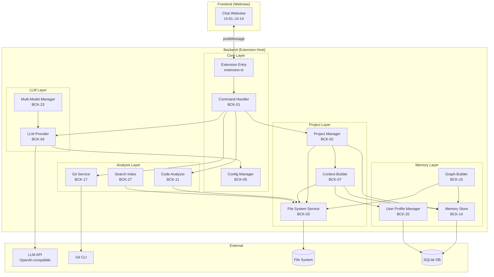

# Архитектура расширения Devil

## Обзор

Devil — это расширение VS Code, реализующее интеллектуального агента-ассистента для разработчиков с долговременной памятью. Архитектура построена по принципу **разделения ответственности** (Separation of Concerns) и состоит из 6 основных модулей.

## Диаграмма модулей



## Описание модулей

### 1. Core Layer (Ядро)

**Ответственность:** Точка входа, регистрация команд, управление конфигурацией.

#### Extension Entry (`extension.ts`)
- **Задача:** BCK-01
- **Файл:** `src/extension.ts`
- **Ответственность:**
  - Активация расширения
  - Регистрация команд (`devil.openChat`, `devil.openProject`, `/explain`, `/roadmap`, и т.д.)
  - Инициализация сервисов
  - Освобождение ресурсов при деактивации

#### Command Handler
- **Задача:** BCK-01
- **Файл:** `src/commands/CommandHandler.ts`
- **Ответственность:**
  - Маршрутизация команд из чата
  - Парсинг аргументов команд (`/explain file.ts`, `/whereis App`)
  - Вызов соответствующих сервисов
  - Возврат результатов в Webview

#### Config Manager
- **Задача:** BCK-05
- **Файл:** `src/services/ConfigManager.ts`
- **Ответственность:**
  - Чтение настроек из `vscode.workspace.getConfiguration('devil')`
  - Управление `baseUrl`, `apiKey`, `model`, `maxRetries`
  - Подписка на изменения настроек
  - Валидация конфигурации

**Ключевые методы:**
```typescript
class ConfigManager {
  getBaseUrl(): string;
  getApiKey(): string;
  getModel(): string;
  getMaxRetries(): number;
  onConfigChanged(callback: () => void): void;
}
```

---

### 2. Project Layer (Управление проектом)

**Ответственность:** Управление текущим проектом, сканирование файловой системы, построение контекста.

#### Project Manager
- **Задача:** BCK-02
- **Файл:** `src/services/ProjectManager.ts`
- **Ответственность:**
  - Хранение текущего `workspaceFolder`
  - Управление путём к `.devil/`
  - Сканирование структуры проекта
  - Отслеживание изменений через `FileSystemWatcher`

**Ключевые методы:**
```typescript
class ProjectManager {
  getCurrentProject(): ProjectInfo;
  setProject(folder: vscode.WorkspaceFolder): void;
  getProjectStructure(): FileTree;
  getDevilPath(): string;
  onFileChanged(callback: (event: FileChangeEvent) => void): void;
}

interface ProjectInfo {
  name: string;
  path: string;
  devilPath: string;
  fileCount: number;
}
```

#### File System Service
- **Задача:** BCK-03
- **Файл:** `src/services/FileSystemService.ts`
- **Ответственность:**
  - Чтение/запись файлов
  - Сканирование директорий (рекурсивное)
  - Исключение `.git`, `node_modules`, `out`, `backups`
  - Построение дерева файлов

**Ключевые методы:**
```typescript
class FileSystemService {
  readFile(path: string): Promise<string>;
  writeFile(path: string, content: string): Promise<void>;
  scanDirectory(rootPath: string, options?: ScanOptions): Promise<FileTree>;
  fileExists(path: string): Promise<boolean>;
}

interface ScanOptions {
  excludePatterns?: string[];
  maxDepth?: number;
  includeContent?: boolean;
}

interface FileTree {
  name: string;
  path: string;
  type: 'file' | 'directory';
  children?: FileTree[];
  content?: string;
}
```

#### Context Builder
- **Задача:** BCK-07
- **Файл:** `src/services/ContextBuilder.ts`
- **Ответственность:**
  - Формирование системного промпта для LLM
  - Включение структуры проекта, Roadmap, чек-листа
  - Добавление информации из графовой памяти
  - Включение профиля пользователя

**Ключевые методы:**
```typescript
class ContextBuilder {
  buildContext(query: string, project: ProjectInfo): Promise<string>;
  includeProjectStructure(include: boolean): void;
  includeRoadmap(include: boolean): void;
  includeMemoryGraph(include: boolean): void;
  includeUserProfile(include: boolean): void;
}
```

---

### 3. LLM Layer (Работа с LLM)

**Ответственность:** Абстракция над LLM API, управление моделями, повторные попытки.

#### LLM Provider
- **Задача:** BCK-04
- **Файл:** `src/services/LLMProvider.ts`
- **Ответственность:**
  - Отправка запросов к LLM API (OpenAI-совместимый)
  - Обработка ответов (streaming, non-streaming)
  - Повторные попытки при ошибках
  - Логирование запросов/ответов

**Ключевые методы:**
```typescript
class LLMProvider {
  generate(prompt: string, options?: GenerateOptions): Promise<LLMResponse>;
  generateStream(prompt: string, options?: GenerateOptions): AsyncIterable<string>;
  setModel(model: string): void;
  setBaseUrl(url: string): void;
  setApiKey(key: string): void;
}

interface GenerateOptions {
  temperature?: number;
  maxTokens?: number;
  systemPrompt?: string;
  stream?: boolean;
}

interface LLMResponse {
  content: string;
  model: string;
  tokensUsed: number;
  finishReason: string;
}
```

#### Multi-Model Manager
- **Задача:** BCK-23
- **Файл:** `src/services/MultiModelManager.ts`
- **Ответственность:**
  - Управление несколькими конфигурациями моделей
  - Переключение между моделями
  - Назначение моделей для разных задач (быстрая для чата, мощная для рефакторинга)

**Ключевые методы:**
```typescript
class MultiModelManager {
  getAvailableModels(): ModelConfig[];
  switchModel(modelId: string): void;
  getModelForTask(task: TaskType): string;
  addModel(config: ModelConfig): void;
}

interface ModelConfig {
  id: string;
  name: string;
  baseUrl: string;
  apiKey: string;
  model: string;
  taskTypes: TaskType[];
}

type TaskType = 'chat' | 'refactor' | 'generate' | 'explain';
```

---

### 4. Memory Layer (Память и обучение)

**Ответственность:** Графовая память, профиль пользователя, долговременное хранение.

#### Memory Store
- **Задача:** BCK-14
- **Файл:** `src/services/MemoryStore.ts`
- **Ответственность:**
  - Инициализация SQLite БД в `.devil/memory.db`
  - CRUD операции для узлов и связей графа
  - Поиск узлов по имени, типу, тегам
  - Поиск связей между узлами

**Ключевые методы:**
```typescript
class MemoryStore {
  initialize(dbPath: string): Promise<void>;
  close(): Promise<void>;

  // Nodes
  addNode(node: GraphNode): Promise<void>;
  getNode(id: string): Promise<GraphNode | null>;
  findNodes(query: NodeQuery): Promise<GraphNode[]>;
  updateNode(id: string, updates: Partial<GraphNode>): Promise<void>;
  deleteNode(id: string): Promise<void>;

  // Edges
  addEdge(edge: GraphEdge): Promise<void>;
  getEdgesFrom(nodeId: string): Promise<GraphEdge[]>;
  getEdgesTo(nodeId: string): Promise<GraphEdge[]>;
  deleteEdge(id: string): Promise<void>;
}

interface GraphNode {
  id: string;
  type: NodeType;
  name: string;
  path?: string;
  metadata?: Record<string, any>;
  tags?: string[];
  createdAt: number;
  updatedAt: number;
}

type NodeType = 'file' | 'class' | 'function' | 'variable' | 'technology' | 'decision' | 'concept';

interface GraphEdge {
  id: string;
  from: string;
  to: string;
  type: EdgeType;
  metadata?: Record<string, any>;
}

type EdgeType = 'imports' | 'calls' | 'uses' | 'depends_on' | 'implements' | 'extends' | 'contains';
```

#### Graph Builder
- **Задача:** BCK-15
- **Файл:** `src/services/GraphBuilder.ts`
- **Ответственность:**
  - Парсинг кода (Tree-sitter для TS/JS, RegExp для Python)
  - Извлечение сущностей (функции, классы, импорты)
  - Построение связей между сущностями
  - Инкрементальное обновление графа

**Ключевые методы:**
```typescript
class GraphBuilder {
  buildFromFile(filePath: string): Promise<GraphUpdate>;
  buildFromProject(projectPath: string): Promise<GraphUpdate>;
  updateForFile(filePath: string): Promise<GraphUpdate>;
  removeFile(filePath: string): Promise<void>;
}

interface GraphUpdate {
  addedNodes: GraphNode[];
  removedNodes: string[];
  addedEdges: GraphEdge[];
  removedEdges: string[];
}
```

#### User Profile Manager
- **Задача:** BCK-20
- **Файл:** `src/services/UserProfileManager.ts`
- **Ответственность:**
  - Хранение глобального профиля пользователя
  - Запись предпочтений (стиль кода, библиотеки, паттерны)
  - Обучение на истории взаимодействий
  - Чтение профиля для контекста LLM

**Ключевые методы:**
```typescript
class UserProfileManager {
  getProfile(): Promise<UserProfile>;
  updateProfile(updates: Partial<UserProfile>): Promise<void>;
  addPreference(key: string, value: any): Promise<void>;
  getPreferences(): Promise<Record<string, any>>;
}

interface UserProfile {
  codingStyle: {
    indentStyle: 'tabs' | 'spaces';
    indentSize: number;
    quoteStyle: 'single' | 'double';
    semicolons: boolean;
  };
  preferredLibraries: string[];
  preferredPatterns: string[];
  customInstructions: string[];
  interactionHistory: InteractionRecord[];
}
```

---

### 5. Analysis Layer (Анализ кода)

**Ответственность:** Анализ кода, Git-интеграция, поиск, линтинг.

#### Code Analyzer
- **Задача:** BCK-11
- **Файл:** `src/services/CodeAnalyzer.ts`
- **Ответственность:**
  - Объяснение кода на русском языке
  - Предложение рефакторинга
  - Анализ зависимостей
  - Поиск использования символов

**Ключевые методы:**
```typescript
class CodeAnalyzer {
  explainCode(code: string, filePath: string): Promise<string>;
  suggestRefactoring(code: string, filePath: string): Promise<RefactorSuggestion>;
  findUsages(symbol: string): Promise<UsageLocation[]>;
  analyzeDependencies(filePath: string): Promise<DependencyGraph>;
}

interface RefactorSuggestion {
  originalCode: string;
  refactoredCode: string;
  explanation: string;
  improvements: string[];
}

interface UsageLocation {
  filePath: string;
  line: number;
  column: number;
  context: string;
}
```

#### Git Service
- **Задача:** BCK-17
- **Файл:** `src/services/GitService.ts`
- **Ответственность:**
  - Чтение истории коммитов
  - Получение diff между коммитами
  - Анализ изменений файла
  - Интеграция через `child_process` (git CLI)

**Ключевые методы:**
```typescript
class GitService {
  getLog(filePath?: string, limit?: number): Promise<GitCommit[]>;
  getDiff(commitA: string, commitB: string): Promise<string>;
  getFileHistory(filePath: string): Promise<GitCommit[]>;
  getCurrentBranch(): Promise<string>;
}

interface GitCommit {
  hash: string;
  author: string;
  date: string;
  message: string;
  filesChanged: string[];
}
```

#### Search Index
- **Задача:** BCK-27
- **Файл:** `src/services/SearchIndex.ts`
- **Ответственность:**
  - Построение индекса по содержимому файлов
  - Полнотекстовый поиск
  - Семантический поиск (векторный)
  - Инкрементальное обновление индекса

**Ключевые методы:**
```typescript
class SearchIndex {
  buildIndex(projectPath: string): Promise<void>;
  searchText(query: string): Promise<SearchResult[]>;
  searchSemantic(query: string): Promise<SearchResult[]>;
  updateIndex(filePath: string): Promise<void>;
  removeFromIndex(filePath: string): Promise<void>;
}

interface SearchResult {
  filePath: string;
  line: number;
  content: string;
  score: number;
  highlights: string[];
}
```

---

### 6. Frontend Layer (Webview)

**Ответственность:** Чат-интерфейс, отображение результатов, взаимодействие с пользователем.

#### Chat Webview
- **Задача:** UI-01..UI-14
- **Файл:** `webview/chat.html`, `webview/chat.js`, `webview/chat.css`
- **Ответственность:**
  - Отображение истории сообщений
  - Поле ввода, кнопка отправки
  - Рендеринг Markdown (marked/markdown-it)
  - Подсветка синтаксиса (highlight.js)
  - Кнопки копирования кода
  - Обмен сообщениями с расширением (postMessage API)

**Поток данных:**
```typescript
// Webview → Extension
webview.postMessage({
  type: 'userMessage',
  content: '/explain src/extension.ts',
  id: 'msg_123'
});

// Extension → Webview
webview.postMessage({
  type: 'agentResponse',
  content: '## Объяснение\n\nФайл `extension.ts`...',
  id: 'msg_123',
  metadata: { tokensUsed: 150, model: 'gpt-4o-mini' }
});
```

---

## Потоки данных

### 1. Отправка сообщения в чат

```
User → Webview (postMessage: userMessage)
     → Extension (CommandHandler.handleMessage)
     → ContextBuilder.buildContext (добавляет структуру проекта, память)
     → LLMProvider.generate (отправляет запрос к LLM API)
     → LLM API (возвращает ответ)
     → CommandHandler (обрабатывает ответ)
     → Webview (postMessage: agentResponse)
     → User (видит ответ в чате)
```

### 2. Сканирование проекта и построение графа

```
User → Command: devil.openProject
     → ProjectManager.setProject
     → FileSystemService.scanDirectory
     → GraphBuilder.buildFromProject
       → Парсинг каждого файла (Tree-sitter/RegExp)
       → Извлечение сущностей (функции, классы, импорты)
       → MemoryStore.addNode / addEdge
     → ProjectManager.onFileChanged (подписка на изменения)
```

### 3. Команда /whereis [symbol]

```
User → Webview (postMessage: /whereis App)
     → CommandHandler.parseCommand
     → MemoryStore.findNodes({ name: 'App', type: 'class' })
     → MemoryStore.getEdgesTo(nodeId) (находит все связи)
     → Формирование списка файлов
     → Webview (postMessage: список файлов с путями)
     → User (видит список, кликает → открывается файл)
```

### 4. Генерация Roadmap

```
User → Webview (postMessage: /roadmap generate)
     → CommandHandler.parseCommand
     → ProjectManager.getProjectStructure
     → ContextBuilder.buildContext (включает структуру проекта)
     → LLMProvider.generate (промпт: "Создай Roadmap для проекта...")
     → FileSystemService.writeFile('.devil/roadmap.md', response)
     → Webview (postMessage: "Roadmap создан: .devil/roadmap.md")
     → User (видит подтверждение, открывает файл)
```

---

## Технологический стек

| Компонент | Технология | Обоснование |
|-----------|-----------|-------------|
| Расширение VS Code | TypeScript, VS Code API | Нативная интеграция, богатый API |
| Backend-логика | Node.js (TypeScript) | Единый стек, удобная работа с ФС, HTTP |
| Хранилище данных | SQLite (better-sqlite3) | Легковесная, встроенная БД, не требует установки |
| HTTP-клиент | Axios | Простой и надёжный REST-клиент |
| Парсинг кода | Tree-sitter (WASM) | Быстрый AST-парсинг для TS/JS |
| Полнотекстовый поиск | flexsearch | Быстрый индекс, поддержка fuzzy search |
| Markdown-рендеринг | marked + highlight.js | Рендеринг Markdown с подсветкой синтаксиса |
| Тестирование | Jest + ts-jest | Модульное и интеграционное тестирование |

---

## Структура папок

```
src/
├── extension.ts              # Точка входа (BCK-01)
├── commands/
│   └── CommandHandler.ts     # Обработчик команд (BCK-01)
├── services/
│   ├── ConfigManager.ts      # Управление конфигурацией (BCK-05)
│   ├── ProjectManager.ts     # Управление проектом (BCK-02)
│   ├── FileSystemService.ts  # Работа с файловой системой (BCK-03)
│   ├── ContextBuilder.ts     # Построение контекста для LLM (BCK-07)
│   ├── LLMProvider.ts        # Работа с LLM API (BCK-04)
│   ├── MultiModelManager.ts  # Управление моделями (BCK-23)
│   ├── MemoryStore.ts        # Графовая память (BCK-14)
│   ├── GraphBuilder.ts       # Построение графа (BCK-15)
│   ├── UserProfileManager.ts # Профиль пользователя (BCK-20)
│   ├── CodeAnalyzer.ts       # Анализ кода (BCK-11)
│   ├── GitService.ts         # Git-интеграция (BCK-17)
│   └── SearchIndex.ts        # Индексация и поиск (BCK-27)
├── interfaces/
│   ├── ILLMProvider.ts       # Контракт для LLM (ARCH-03)
│   ├── IMemoryStore.ts       # Контракт для памяти (ARCH-03)
│   └── IProjectManager.ts    # Контракт для проекта
└── utils/
    ├── logger.ts             # Логирование
    └── errors.ts             # Кастомные ошибки

webview/
├── chat.html                 # HTML-разметка чата
├── chat.css                  # Стили чата
├── chat.js                   # Логика чата (postMessage)
└── assets/
    └── icons/                # Иконки для кнопок

tests/
├── unit/                     # Модульные тесты
│   ├── ConfigManager.test.ts
│   ├── LLMProvider.test.ts
│   └── MemoryStore.test.ts
└── integration/              # Интеграционные тесты
    ├── CommandHandler.test.ts
    └── ProjectManager.test.ts

.devil/                       # Данные проекта (не коммитится)
├── memory.db                 # SQLite БД графовой памяти
├── roadmap.md                # Roadmap проекта
├── checklist.md              # Чек-лист файлов
├── history.json              # История диалогов
└── user-profile.json         # Глобальный профиль пользователя
```

---

## Принципы проектирования

1. **Разделение ответственности:** Каждый модуль отвечает за одну область (проект, LLM, память, анализ).
2. **Зависимости через интерфейсы:** Модули зависят от абстракций (интерфейсов), а не от конкретных реализаций.
3. **Асинхронность:** Все операции с ФС, БД, HTTP — асинхронные (`Promise`, `async/await`).
4. **Обработка ошибок:** Каждый сервис обрабатывает свои ошибки, логирует их, возвращает понятные сообщения.
5. **Тестируемость:** Каждый модуль можно протестировать изолированно с моками зависимостей.
6. **Расширяемость:** Новые команды и функции добавляются без изменения существующего кода (Open/Closed Principle).

---

## Следующие шаги

1. **ARCH-02:** Спроектировать схему данных SQLite для графовой памяти (таблицы `nodes`, `edges`, `cache`).
2. **ARCH-03:** Спроектировать контракты (интерфейсы TypeScript) для `ILLMProvider` и `IMemoryStore`.
3. **UI-DESIGN-01:** Создать статический HTML/CSS макет чат-панели.

---

**Дата создания:** 2026-06-25
**Версия:** 1.0
**Статус:** Утверждено
