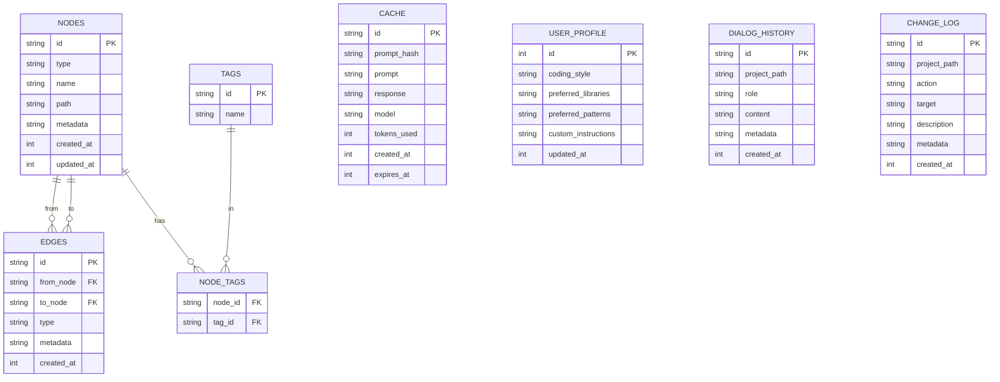

# Схема базы данных SQLite для расширения Devil

## Обзор

Расширение Devil использует SQLite для хранения:
- **Графовой памяти** (узлы и связи между сущностями проекта)
- **Кэша ответов LLM** (для ускорения повторяющихся запросов)
- **Профиля пользователя** (предпочтения, стиль кода)
- **Истории диалогов** (сообщения чата по проекту)
- **Лога изменений** (журнал действий агента)

Все данные хранятся в файле `.devil/memory.db` в корне проекта.

## Диаграмма базы данных (ER-диаграмма)



## Таблицы

### 1. `nodes` — Узлы графа памяти

Хранит все сущности проекта: файлы, классы, функции, переменные, технологии, решения, концепции.

```sql
CREATE TABLE IF NOT EXISTS nodes (
    id TEXT PRIMARY KEY,
    type TEXT NOT NULL CHECK (type IN ('file', 'class', 'function', 'variable', 'technology', 'decision', 'concept')),
    name TEXT NOT NULL,
    path TEXT,
    metadata TEXT DEFAULT '{}',
    created_at INTEGER NOT NULL,
    updated_at INTEGER NOT NULL
);
```

**Поля:**
- `id` — UUID (генерируется в коде, например `crypto.randomUUID()`)
- `type` — тип сущности (ограничен CHECK constraint)
- `name` — имя сущности (например, `App`, `handleSubmit`, `React`)
- `path` — путь к файлу (для `file`, `class`, `function`)
- `metadata` — JSON с дополнительными данными (например, `{ "line": 42, "exported": true }`)
- `created_at`, `updated_at` — Unix timestamp в миллисекундах

**Примеры данных:**
```json
{
  "id": "550e8400-e29b-41d4-a716-446655440000",
  "type": "function",
  "name": "handleSubmit",
  "path": "src/components/Form.tsx",
  "metadata": { "line": 42, "exported": true, "async": true },
  "created_at": 1719312000000,
  "updated_at": 1719312000000
}
```

---

### 2. `edges` — Связи между узлами

Хранит связи между сущностями: импорты, вызовы, зависимости, наследование.

```sql
CREATE TABLE IF NOT EXISTS edges (
    id TEXT PRIMARY KEY,
    from_node TEXT NOT NULL,
    to_node TEXT NOT NULL,
    type TEXT NOT NULL CHECK (type IN ('imports', 'calls', 'uses', 'depends_on', 'implements', 'extends', 'contains')),
    metadata TEXT DEFAULT '{}',
    created_at INTEGER NOT NULL,
    FOREIGN KEY (from_node) REFERENCES nodes(id) ON DELETE CASCADE,
    FOREIGN KEY (to_node) REFERENCES nodes(id) ON DELETE CASCADE
);
```

**Поля:**
- `id` — UUID
- `from_node` — ID узла-источника (например, функция, которая вызывает)
- `to_node` — ID узла-целевого (например, функция, которую вызывают)
- `type` — тип связи (ограничен CHECK constraint)
- `metadata` — JSON с дополнительными данными (например, `{ "line": 15 }`)
- `created_at` — Unix timestamp

**Примеры данных:**
```json
{
  "id": "660e8400-e29b-41d4-a716-446655440001",
  "from_node": "550e8400-e29b-41d4-a716-446655440000",
  "to_node": "770e8400-e29b-41d4-a716-446655440002",
  "type": "calls",
  "metadata": { "line": 45 },
  "created_at": 1719312000000
}
```

---

### 3. `tags` и `node_tags` — Теги для узлов

Реализует many-to-many связь между узлами и тегами для гибкой классификации.

```sql
CREATE TABLE IF NOT EXISTS tags (
    id TEXT PRIMARY KEY,
    name TEXT NOT NULL UNIQUE
);

CREATE TABLE IF NOT EXISTS node_tags (
    node_id TEXT NOT NULL,
    tag_id TEXT NOT NULL,
    PRIMARY KEY (node_id, tag_id),
    FOREIGN KEY (node_id) REFERENCES nodes(id) ON DELETE CASCADE,
    FOREIGN KEY (tag_id) REFERENCES tags(id) ON DELETE CASCADE
);
```

**Примеры тегов:** `frontend`, `backend`, `api`, `ui`, `test`, `deprecated`, `critical`

---

### 4. `cache` — Кэш ответов LLM

Хранит ответы LLM для ускорения повторяющихся запросов.

```sql
CREATE TABLE IF NOT EXISTS cache (
    id TEXT PRIMARY KEY,
    prompt_hash TEXT NOT NULL UNIQUE,
    prompt TEXT NOT NULL,
    response TEXT NOT NULL,
    model TEXT NOT NULL,
    tokens_used INTEGER NOT NULL,
    created_at INTEGER NOT NULL,
    expires_at INTEGER NOT NULL
);
```

**Поля:**
- `prompt_hash` — SHA-256 хэш промпта (для быстрого поиска)
- `expires_at` — Unix timestamp, после которого запись считается устаревшей

**TTL (Time-To-Live):** По умолчанию 7 дней (604800 секунд). Настраивается в `ConfigManager`.

---

### 5. `user_profile` — Глобальный профиль пользователя

Singleton-таблица (всегда одна запись с `id = 1`). Хранит предпочтения пользователя.

```sql
CREATE TABLE IF NOT EXISTS user_profile (
    id INTEGER PRIMARY KEY CHECK (id = 1),
    coding_style TEXT DEFAULT '{}',
    preferred_libraries TEXT DEFAULT '[]',
    preferred_patterns TEXT DEFAULT '[]',
    custom_instructions TEXT DEFAULT '[]',
    updated_at INTEGER NOT NULL
);
```

**Пример данных:**
```json
{
  "id": 1,
  "coding_style": {
    "indentStyle": "spaces",
    "indentSize": 2,
    "quoteStyle": "single",
    "semicolons": true
  },
  "preferred_libraries": ["React", "TypeScript", "Tailwind CSS"],
  "preferred_patterns": ["Functional components", "Hooks", "Redux Toolkit"],
  "custom_instructions": ["Всегда используй TypeScript", "Избегай any"],
  "updated_at": 1719312000000
}
```

---

### 6. `dialog_history` — История диалогов

Хранит сообщения чата по проекту.

```sql
CREATE TABLE IF NOT EXISTS dialog_history (
    id TEXT PRIMARY KEY,
    project_path TEXT NOT NULL,
    role TEXT NOT NULL CHECK (role IN ('user', 'assistant', 'system')),
    content TEXT NOT NULL,
    metadata TEXT DEFAULT '{}',
    created_at INTEGER NOT NULL
);
```

**Поля:**
- `project_path` — путь к проекту (для фильтрации истории по проекту)
- `role` — роль автора сообщения
- `metadata` — JSON с дополнительными данными (например, `{ "tokens": 150, "model": "gpt-4o-mini" }`)

---

### 7. `change_log` — Лог изменений

Журнал действий агента: создание файлов, сканирование, генерация кода.

```sql
CREATE TABLE IF NOT EXISTS change_log (
    id TEXT PRIMARY KEY,
    project_path TEXT NOT NULL,
    action TEXT NOT NULL CHECK (action IN ('create', 'update', 'delete', 'scan', 'generate')),
    target TEXT NOT NULL,
    description TEXT,
    metadata TEXT DEFAULT '{}',
    created_at INTEGER NOT NULL
);
```

**Примеры действий:**
- `create` — создан файл
- `update` — изменён файл
- `delete` — удалён файл
- `scan` — просканирован проект
- `generate` — сгенерирован код/Roadmap/чек-лист

---

## Индексы

Для ускорения поиска создаём индексы на часто используемые поля.

```sql
-- Индексы для nodes
CREATE INDEX IF NOT EXISTS idx_nodes_type ON nodes(type);
CREATE INDEX IF NOT EXISTS idx_nodes_name ON nodes(name);
CREATE INDEX IF NOT EXISTS idx_nodes_path ON nodes(path);
CREATE INDEX IF NOT EXISTS idx_nodes_updated_at ON nodes(updated_at);

-- Индексы для edges
CREATE INDEX IF NOT EXISTS idx_edges_from_node ON edges(from_node);
CREATE INDEX IF NOT EXISTS idx_edges_to_node ON edges(to_node);
CREATE INDEX IF NOT EXISTS idx_edges_type ON edges(type);

-- Индексы для cache
CREATE INDEX IF NOT EXISTS idx_cache_prompt_hash ON cache(prompt_hash);
CREATE INDEX IF NOT EXISTS idx_cache_expires_at ON cache(expires_at);

-- Индексы для dialog_history
CREATE INDEX IF NOT EXISTS idx_dialog_project_path ON dialog_history(project_path);
CREATE INDEX IF NOT EXISTS idx_dialog_created_at ON dialog_history(created_at);

-- Индексы для change_log
CREATE INDEX IF NOT EXISTS idx_change_log_project_path ON change_log(project_path);
CREATE INDEX IF NOT EXISTS idx_change_log_created_at ON change_log(created_at);
```

---

## Примеры запросов

### 1. Найти все функции в проекте

```sql
SELECT id, name, path, metadata
FROM nodes
WHERE type = 'function'
ORDER BY name;
```

### 2. Найти все файлы, где используется класс `App`

```sql
SELECT n.name, n.path
FROM nodes n
JOIN edges e ON n.id = e.from_node
WHERE e.to_node IN (
    SELECT id FROM nodes WHERE name = 'App' AND type = 'class'
)
AND e.type = 'uses';
```

### 3. Найти все импорты файла `src/App.tsx`

```sql
SELECT n.name, n.path
FROM nodes n
JOIN edges e ON n.id = e.to_node
WHERE e.from_node IN (
    SELECT id FROM nodes WHERE path = 'src/App.tsx' AND type = 'file'
)
AND e.type = 'imports';
```

### 4. Получить кэшированный ответ LLM

```sql
SELECT response, model, tokens_used
FROM cache
WHERE prompt_hash = 'abc123...'
AND expires_at > strftime('%s', 'now') * 1000;
```

### 5. Получить историю диалогов для проекта

```sql
SELECT role, content, metadata, created_at
FROM dialog_history
WHERE project_path = '/path/to/project'
ORDER BY created_at ASC;
```

### 6. Получить лог изменений за последние 7 дней

```sql
SELECT action, target, description, created_at
FROM change_log
WHERE project_path = '/path/to/project'
AND created_at > strftime('%s', 'now') * 1000 - 604800000
ORDER BY created_at DESC;
```

---

## Миграции

Для управления изменениями схемы используем таблицу `migrations`.

```sql
CREATE TABLE IF NOT EXISTS migrations (
    id INTEGER PRIMARY KEY,
    name TEXT NOT NULL UNIQUE,
    applied_at INTEGER NOT NULL
);
```

**Пример миграции:**
```sql
INSERT INTO migrations (id, name, applied_at)
VALUES (1, '001_initial_schema', 1719312000000);
```

---

## Полный SQL-скрипт создания схемы

```sql
-- Таблицы
CREATE TABLE IF NOT EXISTS nodes (
    id TEXT PRIMARY KEY,
    type TEXT NOT NULL CHECK (type IN ('file', 'class', 'function', 'variable', 'technology', 'decision', 'concept')),
    name TEXT NOT NULL,
    path TEXT,
    metadata TEXT DEFAULT '{}',
    created_at INTEGER NOT NULL,
    updated_at INTEGER NOT NULL
);

CREATE TABLE IF NOT EXISTS edges (
    id TEXT PRIMARY KEY,
    from_node TEXT NOT NULL,
    to_node TEXT NOT NULL,
    type TEXT NOT NULL CHECK (type IN ('imports', 'calls', 'uses', 'depends_on', 'implements', 'extends', 'contains')),
    metadata TEXT DEFAULT '{}',
    created_at INTEGER NOT NULL,
    FOREIGN KEY (from_node) REFERENCES nodes(id) ON DELETE CASCADE,
    FOREIGN KEY (to_node) REFERENCES nodes(id) ON DELETE CASCADE
);

CREATE TABLE IF NOT EXISTS tags (
    id TEXT PRIMARY KEY,
    name TEXT NOT NULL UNIQUE
);

CREATE TABLE IF NOT EXISTS node_tags (
    node_id TEXT NOT NULL,
    tag_id TEXT NOT NULL,
    PRIMARY KEY (node_id, tag_id),
    FOREIGN KEY (node_id) REFERENCES nodes(id) ON DELETE CASCADE,
    FOREIGN KEY (tag_id) REFERENCES tags(id) ON DELETE CASCADE
);

CREATE TABLE IF NOT EXISTS cache (
    id TEXT PRIMARY KEY,
    prompt_hash TEXT NOT NULL UNIQUE,
    prompt TEXT NOT NULL,
    response TEXT NOT NULL,
    model TEXT NOT NULL,
    tokens_used INTEGER NOT NULL,
    created_at INTEGER NOT NULL,
    expires_at INTEGER NOT NULL
);

CREATE TABLE IF NOT EXISTS user_profile (
    id INTEGER PRIMARY KEY CHECK (id = 1),
    coding_style TEXT DEFAULT '{}',
    preferred_libraries TEXT DEFAULT '[]',
    preferred_patterns TEXT DEFAULT '[]',
    custom_instructions TEXT DEFAULT '[]',
    updated_at INTEGER NOT NULL
);

CREATE TABLE IF NOT EXISTS dialog_history (
    id TEXT PRIMARY KEY,
    project_path TEXT NOT NULL,
    role TEXT NOT NULL CHECK (role IN ('user', 'assistant', 'system')),
    content TEXT NOT NULL,
    metadata TEXT DEFAULT '{}',
    created_at INTEGER NOT NULL
);

CREATE TABLE IF NOT EXISTS change_log (
    id TEXT PRIMARY KEY,
    project_path TEXT NOT NULL,
    action TEXT NOT NULL CHECK (action IN ('create', 'update', 'delete', 'scan', 'generate')),
    target TEXT NOT NULL,
    description TEXT,
    metadata TEXT DEFAULT '{}',
    created_at INTEGER NOT NULL
);

CREATE TABLE IF NOT EXISTS migrations (
    id INTEGER PRIMARY KEY,
    name TEXT NOT NULL UNIQUE,
    applied_at INTEGER NOT NULL
);

-- Индексы
CREATE INDEX IF NOT EXISTS idx_nodes_type ON nodes(type);
CREATE INDEX IF NOT EXISTS idx_nodes_name ON nodes(name);
CREATE INDEX IF NOT EXISTS idx_nodes_path ON nodes(path);
CREATE INDEX IF NOT EXISTS idx_nodes_updated_at ON nodes(updated_at);

CREATE INDEX IF NOT EXISTS idx_edges_from_node ON edges(from_node);
CREATE INDEX IF NOT EXISTS idx_edges_to_node ON edges(to_node);
CREATE INDEX IF NOT EXISTS idx_edges_type ON edges(type);

CREATE INDEX IF NOT EXISTS idx_cache_prompt_hash ON cache(prompt_hash);
CREATE INDEX IF NOT EXISTS idx_cache_expires_at ON cache(expires_at);

CREATE INDEX IF NOT EXISTS idx_dialog_project_path ON dialog_history(project_path);
CREATE INDEX IF NOT EXISTS idx_dialog_created_at ON dialog_history(created_at);

CREATE INDEX IF NOT EXISTS idx_change_log_project_path ON change_log(project_path);
CREATE INDEX IF NOT EXISTS idx_change_log_created_at ON change_log(created_at);

-- Начальная миграция
INSERT INTO migrations (id, name, applied_at)
VALUES (1, '001_initial_schema', strftime('%s', 'now') * 1000);
```

---

## Следующие шаги

1. **ARCH-03:** Спроектировать контракты (интерфейсы TypeScript) для `ILLMProvider` и `IMemoryStore`.
2. **BCK-14:** Реализовать `MemoryStore` на основе этой схемы.
3. **UI-DESIGN-01:** Создать статический HTML/CSS макет чат-панели.

---

**Дата создания:** 2026-06-25
**Версия:** 1.0
**Статус:** Утверждено

---

```markdown
# Дополнение к схеме базы данных Devil: Managed Auto-Memory

**Дата:** 2026-07-03
**Версия:** 1.0
**Статус:** Согласовано с заказчиком
**Источник концепции:** Архитектура Managed Auto-Memory от Qwen Code (адаптировано под Devil)
**Связанные документы:** update-roadmap-memory.md, update-tz-memory.md, update-architecture.md

---

## 1. Обоснование изменений

На основе внедрения системы Managed Auto-Memory (Extract/Dream/Recall/Forget) необходимо расширить существующую схему SQLite для поддержки:
- Новых типов узлов (`reference` — ссылки на внешние ресурсы)
- Векторных представлений узлов (для семантического поиска по памяти)
- Новых действий в логе изменений (extract, dream, recall, forget)

Все изменения реализованы через миграции, не ломают существующую схему и обратно совместимы.

---

## 2. Изменения в таблице `nodes`

### 2.1. Добавление типа `reference`

Расширяем CHECK constraint для поддержки ссылок на внешние ресурсы (документация, дашборды, тикеты, API-эндпоинты).

**Было:**
```sql
type TEXT NOT NULL CHECK (type IN ('file', 'class', 'function', 'variable', 'technology', 'decision', 'concept'))
```

**Стало:**
```sql
type TEXT NOT NULL CHECK (type IN ('file', 'class', 'function', 'variable', 'technology', 'decision', 'concept', 'reference'))
```

### 2.2. Расширение metadata для новых типов

Для узлов типов `decision`, `concept`, `reference` поддерживаем в `metadata` JSON поля:

```json
{
  "why": "Причина принятия решения или важность знания",
  "how_to_apply": "Когда и как применять это знание"
}
```

Для узлов типа `reference` дополнительно:
```json
{
  "url": "https://docs.example.com/api",
  "description": "Документация API проекта",
  "last_accessed": 1751414400000,
  "why": "Используем этот API для интеграции с платёжной системой",
  "how_to_apply": "См. раздел Authentication в документации"
}
```

### 2.3. Миграция 002: Добавление типа `reference`

```sql
-- Миграция 002: Добавление типа узла 'reference'
-- Дата: 2026-07-03
-- Описание: Расширение CHECK constraint для поддержки ссылок на внешние ресурсы

-- SQLite не поддерживает ALTER TABLE для изменения CHECK constraint,
-- поэтому пересоздаём таблицу с новой схемой.

-- Шаг 1: Создаём временную таблицу
CREATE TABLE nodes_new (
    id TEXT PRIMARY KEY,
    type TEXT NOT NULL CHECK (type IN ('file', 'class', 'function', 'variable', 'technology', 'decision', 'concept', 'reference')),
    name TEXT NOT NULL,
    path TEXT,
    metadata TEXT DEFAULT '{}',
    created_at INTEGER NOT NULL,
    updated_at INTEGER NOT NULL
);

-- Шаг 2: Копируем данные
INSERT INTO nodes_new SELECT * FROM nodes;

-- Шаг 3: Удаляем старую таблицу
DROP TABLE nodes;

-- Шаг 4: Переименовываем новую таблицу
ALTER TABLE nodes_new RENAME TO nodes;

-- Шаг 5: Восстанавливаем индексы
CREATE INDEX IF NOT EXISTS idx_nodes_type ON nodes(type);
CREATE INDEX IF NOT EXISTS idx_nodes_name ON nodes(name);
CREATE INDEX IF NOT EXISTS idx_nodes_path ON nodes(path);
CREATE INDEX IF NOT EXISTS idx_nodes_updated_at ON nodes(updated_at);

-- Шаг 6: Регистрируем миграцию
INSERT INTO migrations (id, name, applied_at)
VALUES (2, '002_add_reference_node_type', strftime('%s', 'now') * 1000);
```

---

## 3. Новая таблица `node_embeddings`

### 3.1. Назначение

Хранит векторные представления узлов графа для семантического поиска по памяти (BCK-29). Используется в операции Recall для поиска релевантных узлов по смыслу, а не только по имени.

### 3.2. Схема таблицы

```sql
CREATE TABLE IF NOT EXISTS node_embeddings (
    id TEXT PRIMARY KEY,
    node_id TEXT NOT NULL UNIQUE,
    embedding BLOB NOT NULL,
    model TEXT NOT NULL,
    dimensions INTEGER NOT NULL,
    text_hash TEXT NOT NULL,
    created_at INTEGER NOT NULL,
    FOREIGN KEY (node_id) REFERENCES nodes(id) ON DELETE CASCADE
);
```

### 3.3. Поля

| Поле | Тип | Описание |
|------|-----|----------|
| `id` | TEXT | UUID записи |
| `node_id` | TEXT | ID узла (UNIQUE, один embedding на узел) |
| `embedding` | BLOB | Векторное представление (Float32Array в бинарном формате) |
| `model` | TEXT | Модель, использованная для векторизации (например, `all-MiniLM-L6-v2`) |
| `dimensions` | INTEGER | Размерность вектора (например, 384) |
| `text_hash` | TEXT | SHA-256 хэш текста, использованного для векторизации (для проверки актуальности) |
| `created_at` | INTEGER | Unix timestamp создания |

### 3.4. Пример данных

```json
{
  "id": "880e8400-e29b-41d4-a716-446655440003",
  "node_id": "550e8400-e29b-41d4-a716-446655440000",
  "embedding": "<binary Float32Array, 384 dimensions>",
  "model": "all-MiniLM-L6-v2",
  "dimensions": 384,
  "text_hash": "abc123def456...",
  "created_at": 1751414400000
}
```

### 3.5. Текст для векторизации

Для каждого узла формируется текст, который векторизуется:

```typescript
function buildEmbeddingText(node: GraphNode): string {
  const parts = [node.name];

  if (node.path) parts.push(`File: ${node.path}`);
  if (node.metadata?.why) parts.push(`Why: ${node.metadata.why}`);
  if (node.metadata?.how_to_apply) parts.push(`How to apply: ${node.metadata.how_to_apply}`);
  if (node.metadata?.description) parts.push(node.metadata.description);

  return parts.join('. ');
}
```

### 3.6. Индексы

```sql
CREATE INDEX IF NOT EXISTS idx_node_embeddings_node_id ON node_embeddings(node_id);
CREATE INDEX IF NOT EXISTS idx_node_embeddings_text_hash ON node_embeddings(text_hash);
```

### 3.7. Миграция 003: Создание таблицы `node_embeddings`

```sql
-- Миграция 003: Создание таблицы node_embeddings
-- Дата: 2026-07-03
-- Описание: Таблица для хранения векторных представлений узлов графа

CREATE TABLE IF NOT EXISTS node_embeddings (
    id TEXT PRIMARY KEY,
    node_id TEXT NOT NULL UNIQUE,
    embedding BLOB NOT NULL,
    model TEXT NOT NULL,
    dimensions INTEGER NOT NULL,
    text_hash TEXT NOT NULL,
    created_at INTEGER NOT NULL,
    FOREIGN KEY (node_id) REFERENCES nodes(id) ON DELETE CASCADE
);

CREATE INDEX IF NOT EXISTS idx_node_embeddings_node_id ON node_embeddings(node_id);
CREATE INDEX IF NOT EXISTS idx_node_embeddings_text_hash ON node_embeddings(text_hash);

-- Регистрируем миграцию
INSERT INTO migrations (id, name, applied_at)
VALUES (3, '003_create_node_embeddings', strftime('%s', 'now') * 1000);
```

---

## 4. Изменения в таблице `change_log`

### 4.1. Добавление новых действий

Расширяем CHECK constraint для поддержки действий системы Managed Auto-Memory.

**Было:**
```sql
action TEXT NOT NULL CHECK (action IN ('create', 'update', 'delete', 'scan', 'generate'))
```

**Стало:**
```sql
action TEXT NOT NULL CHECK (action IN ('create', 'update', 'delete', 'scan', 'generate', 'extract', 'dream', 'recall', 'forget'))
```

### 4.2. Описание новых действий

| Действие | Описание | Когда используется |
|----------|----------|-------------------|
| `extract` | Извлечение знаний из диалога | При триггерах (создание файла, `/remember`) |
| `dream` | Фоновая интеграция памяти | Раз в сутки, вручную через `/dream`, при >100 изменениях |
| `recall` | Поиск релевантной памяти | Перед каждым запросом к LLM (автоматически) |
| `forget` | Удаление записи из памяти | Команда `/forget [id]` |

### 4.3. Формат metadata для новых действий

**Для `extract`:**
```json
{
  "dialog_id": "msg_123",
  "trigger": "file_created",
  "nodes_added": 3,
  "edges_added": 5
}
```

**Для `dream`:**
```json
{
  "duration_ms": 1250,
  "deduplicated_nodes": 5,
  "removed_edges": 12,
  "consolidated_instructions": 2,
  "validation_errors": 0
}
```

**Для `recall`:**
```json
{
  "query": "как реализовать аутентификацию?",
  "nodes_found": 3,
  "search_method": "hybrid",
  "duration_ms": 45
}
```

**Для `forget`:**
```json
{
  "node_id": "550e8400-e29b-41d4-a716-446655440000",
  "node_type": "decision",
  "node_name": "Использовать JWT",
  "edges_removed": 3,
  "embedding_removed": true
}
```

### 4.4. Миграция 004: Добавление новых действий

```sql
-- Миграция 004: Добавление новых действий в change_log
-- Дата: 2026-07-03
-- Описание: Расширение CHECK constraint для поддержки Extract/Dream/Recall/Forget

-- Пересоздаём таблицу с новой схемой
CREATE TABLE change_log_new (
    id TEXT PRIMARY KEY,
    project_path TEXT NOT NULL,
    action TEXT NOT NULL CHECK (action IN ('create', 'update', 'delete', 'scan', 'generate', 'extract', 'dream', 'recall', 'forget')),
    target TEXT NOT NULL,
    description TEXT,
    metadata TEXT DEFAULT '{}',
    created_at INTEGER NOT NULL
);

INSERT INTO change_log_new SELECT * FROM change_log;
DROP TABLE change_log;
ALTER TABLE change_log_new RENAME TO change_log;

-- Восстанавливаем индексы
CREATE INDEX IF NOT EXISTS idx_change_log_project_path ON change_log(project_path);
CREATE INDEX IF NOT EXISTS idx_change_log_created_at ON change_log(created_at);
CREATE INDEX IF NOT EXISTS idx_change_log_action ON change_log(action);

-- Регистрируем миграцию
INSERT INTO migrations (id, name, applied_at)
VALUES (4, '004_add_memory_actions', strftime('%s', 'now') * 1000);
```

---

## 5. Обновлённая ER-диаграмма

```
erDiagram
    NODES ||--o{ EDGES : "from"
    NODES ||--o{ EDGES : "to"
    NODES ||--o{ NODE_TAGS : "has"
    NODES ||--o| NODE_EMBEDDINGS : "has"
    TAGS ||--o{ NODE_TAGS : "in"

    NODES {
        string id PK
        string type
        string name
        string path
        string metadata
        int created_at
        int updated_at
    }

    NODE_EMBEDDINGS {
        string id PK
        string node_id FK
        blob embedding
        string model
        int dimensions
        string text_hash
        int created_at
    }

    EDGES {
        string id PK
        string from_node FK
        string to_node FK
        string type
        string metadata
        int created_at
    }

    CHANGE_LOG {
        string id PK
        string project_path
        string action
        string target
        string description
        string metadata
        int created_at
    }
```

---

## 6. Примеры запросов для новых возможностей

### 6.1. Найти все решения с полями `why` и `how_to_apply`

```sql
SELECT id, name, path, metadata
FROM nodes
WHERE type = 'decision'
AND metadata LIKE '%why%'
AND metadata LIKE '%how_to_apply%';
```

### 6.2. Найти все ссылки на внешние ресурсы

```sql
SELECT id, name, metadata
FROM nodes
WHERE type = 'reference'
ORDER BY name;
```

### 6.3. Получить embedding для узла

```sql
SELECT embedding, model, dimensions
FROM node_embeddings
WHERE node_id = '550e8400-e29b-41d4-a716-446655440000';
```

### 6.4. Найти узлы без embeddings (требуют векторизации)

```sql
SELECT n.id, n.name, n.type
FROM nodes n
LEFT JOIN node_embeddings ne ON n.id = ne.node_id
WHERE ne.node_id IS NULL;
```

### 6.5. Получить отчёт о последнем Dream

```sql
SELECT action, metadata, created_at
FROM change_log
WHERE action = 'dream'
ORDER BY created_at DESC
LIMIT 1;
```

### 6.6. Посчитать статистику операций памяти за день

```sql
SELECT
    action,
    COUNT(*) as count,
    SUM(CAST(json_extract(metadata, '$.nodes_added') AS INTEGER)) as total_nodes
FROM change_log
WHERE action IN ('extract', 'dream', 'recall', 'forget')
AND created_at > strftime('%s', 'now') * 1000 - 86400000
GROUP BY action;
```

---

## 7. Полный SQL-скрипт миграций

```sql
-- ============================================================
-- Миграция 002: Добавление типа узла 'reference'
-- ============================================================

CREATE TABLE nodes_new (
    id TEXT PRIMARY KEY,
    type TEXT NOT NULL CHECK (type IN ('file', 'class', 'function', 'variable', 'technology', 'decision', 'concept', 'reference')),
    name TEXT NOT NULL,
    path TEXT,
    metadata TEXT DEFAULT '{}',
    created_at INTEGER NOT NULL,
    updated_at INTEGER NOT NULL
);

INSERT INTO nodes_new SELECT * FROM nodes;
DROP TABLE nodes;
ALTER TABLE nodes_new RENAME TO nodes;

CREATE INDEX IF NOT EXISTS idx_nodes_type ON nodes(type);
CREATE INDEX IF NOT EXISTS idx_nodes_name ON nodes(name);
CREATE INDEX IF NOT EXISTS idx_nodes_path ON nodes(path);
CREATE INDEX IF NOT EXISTS idx_nodes_updated_at ON nodes(updated_at);

INSERT INTO migrations (id, name, applied_at)
VALUES (2, '002_add_reference_node_type', strftime('%s', 'now') * 1000);

-- ============================================================
-- Миграция 003: Создание таблицы node_embeddings
-- ============================================================

CREATE TABLE IF NOT EXISTS node_embeddings (
    id TEXT PRIMARY KEY,
    node_id TEXT NOT NULL UNIQUE,
    embedding BLOB NOT NULL,
    model TEXT NOT NULL,
    dimensions INTEGER NOT NULL,
    text_hash TEXT NOT NULL,
    created_at INTEGER NOT NULL,
    FOREIGN KEY (node_id) REFERENCES nodes(id) ON DELETE CASCADE
);

CREATE INDEX IF NOT EXISTS idx_node_embeddings_node_id ON node_embeddings(node_id);
CREATE INDEX IF NOT EXISTS idx_node_embeddings_text_hash ON node_embeddings(text_hash);

INSERT INTO migrations (id, name, applied_at)
VALUES (3, '003_create_node_embeddings', strftime('%s', 'now') * 1000);

-- ============================================================
-- Миграция 004: Добавление новых действий в change_log
-- ============================================================

CREATE TABLE change_log_new (
    id TEXT PRIMARY KEY,
    project_path TEXT NOT NULL,
    action TEXT NOT NULL CHECK (action IN ('create', 'update', 'delete', 'scan', 'generate', 'extract', 'dream', 'recall', 'forget')),
    target TEXT NOT NULL,
    description TEXT,
    metadata TEXT DEFAULT '{}',
    created_at INTEGER NOT NULL
);

INSERT INTO change_log_new SELECT * FROM change_log;
DROP TABLE change_log;
ALTER TABLE change_log_new RENAME TO change_log;

CREATE INDEX IF NOT EXISTS idx_change_log_project_path ON change_log(project_path);
CREATE INDEX IF NOT EXISTS idx_change_log_created_at ON change_log(created_at);
CREATE INDEX IF NOT EXISTS idx_change_log_action ON change_log(action);

INSERT INTO migrations (id, name, applied_at)
VALUES (4, '004_add_memory_actions', strftime('%s', 'now') * 1000);
```

---

## 8. Обновление TypeScript-интерфейсов

### 8.1. Расширение NodeType

```typescript
// src/interfaces/IMemoryStore.ts

type NodeType =
  | 'file'
  | 'class'
  | 'function'
  | 'variable'
  | 'technology'
  | 'decision'
  | 'concept'
  | 'reference';  // НОВЫЙ ТИП
```

### 8.2. Расширение ChangeLogAction

```typescript
type ChangeLogAction =
  | 'create'
  | 'update'
  | 'delete'
  | 'scan'
  | 'generate'
  | 'extract'    // НОВОЕ ДЕЙСТВИЕ
  | 'dream'      // НОВОЕ ДЕЙСТВИЕ
  | 'recall'     // НОВОЕ ДЕЙСТВИЕ
  | 'forget';    // НОВОЕ ДЕЙСТВИЕ
```

### 8.3. Новый интерфейс NodeEmbedding

```typescript
interface NodeEmbedding {
  id: string;
  nodeId: string;
  embedding: Float32Array;
  model: string;
  dimensions: number;
  textHash: string;
  createdAt: number;
}
```

### 8.4. Расширение GraphNode metadata

```typescript
interface GraphNode {
  id: string;
  type: NodeType;
  name: string;
  path?: string;
  metadata?: {
    line?: number;
    exported?: boolean;
    async?: boolean;
    // Новые поля для Managed Auto-Memory
    why?: string;
    how_to_apply?: string;
    url?: string;
    description?: string;
    last_accessed?: number;
    [key: string]: any;
  };
  tags?: string[];
  createdAt: number;
  updatedAt: number;
}
```

---

## 9. Итоговая таблица изменений

| Объект | Изменение | Миграция |
|--------|-----------|----------|
| `nodes.type` | +тип `reference` | 002 |
| `nodes.metadata` | +поля `why`, `how_to_apply`, `url`, `description`, `last_accessed` | — (JSON, без миграции) |
| `node_embeddings` | Новая таблица | 003 |
| `change_log.action` | +действия `extract`, `dream`, `recall`, `forget` | 004 |
| Индексы | +`idx_node_embeddings_node_id`, `idx_node_embeddings_text_hash`, `idx_change_log_action` | 003, 004 |

---

## 10. Следующие шаги

1. Применить миграции 002, 003, 004 к существующей БД (или включить в начальный скрипт для новых проектов)
2. Обновить TypeScript-интерфейсы в `src/interfaces/IMemoryStore.ts`
3. Реализовать работу с `node_embeddings` в `SearchIndex` (BCK-29 расширение)
4. Реализовать логирование новых действий в `change_log` при Extract/Dream/Recall/Forget
5. Написать юнит-тесты для миграций и новых запросов

---

**Документ подготовлен:** 2026-07-03
**Версия:** 1.0
**Статус:** Готов к интеграции в основной DATABASE_SCHEMA.md
```

---
