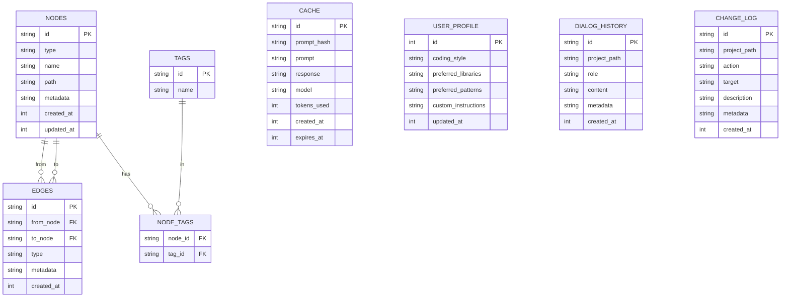

# Схема базы данных SQLite для расширения Devil

## Обзор

Расширение Devil использует SQLite для хранения:
- **Графовой памяти** (узлы и связи между сущностями проекта)
- **Кэша ответов LLM** (для ускорения повторяющихся запросов)
- **Профиля пользователя** (предпочтения, стиль кода)
- **Истории диалогов** (сообщения чата по проекту)
- **Лога изменений** (журнал действий агента)

Все данные хранятся в файле `.devil/memory.db` в корне проекта.

## Диаграмма базы данных (ER-диаграмма)



## Таблицы

### 1. `nodes` — Узлы графа памяти

Хранит все сущности проекта: файлы, классы, функции, переменные, технологии, решения, концепции.

```sql
CREATE TABLE IF NOT EXISTS nodes (
    id TEXT PRIMARY KEY,
    type TEXT NOT NULL CHECK (type IN ('file', 'class', 'function', 'variable', 'technology', 'decision', 'concept')),
    name TEXT NOT NULL,
    path TEXT,
    metadata TEXT DEFAULT '{}',
    created_at INTEGER NOT NULL,
    updated_at INTEGER NOT NULL
);
```

**Поля:**
- `id` — UUID (генерируется в коде, например `crypto.randomUUID()`)
- `type` — тип сущности (ограничен CHECK constraint)
- `name` — имя сущности (например, `App`, `handleSubmit`, `React`)
- `path` — путь к файлу (для `file`, `class`, `function`)
- `metadata` — JSON с дополнительными данными (например, `{ "line": 42, "exported": true }`)
- `created_at`, `updated_at` — Unix timestamp в миллисекундах

**Примеры данных:**
```json
{
  "id": "550e8400-e29b-41d4-a716-446655440000",
  "type": "function",
  "name": "handleSubmit",
  "path": "src/components/Form.tsx",
  "metadata": { "line": 42, "exported": true, "async": true },
  "created_at": 1719312000000,
  "updated_at": 1719312000000
}
```

---

### 2. `edges` — Связи между узлами

Хранит связи между сущностями: импорты, вызовы, зависимости, наследование.

```sql
CREATE TABLE IF NOT EXISTS edges (
    id TEXT PRIMARY KEY,
    from_node TEXT NOT NULL,
    to_node TEXT NOT NULL,
    type TEXT NOT NULL CHECK (type IN ('imports', 'calls', 'uses', 'depends_on', 'implements', 'extends', 'contains')),
    metadata TEXT DEFAULT '{}',
    created_at INTEGER NOT NULL,
    FOREIGN KEY (from_node) REFERENCES nodes(id) ON DELETE CASCADE,
    FOREIGN KEY (to_node) REFERENCES nodes(id) ON DELETE CASCADE
);
```

**Поля:**
- `id` — UUID
- `from_node` — ID узла-источника (например, функция, которая вызывает)
- `to_node` — ID узла-целевого (например, функция, которую вызывают)
- `type` — тип связи (ограничен CHECK constraint)
- `metadata` — JSON с дополнительными данными (например, `{ "line": 15 }`)
- `created_at` — Unix timestamp

**Примеры данных:**
```json
{
  "id": "660e8400-e29b-41d4-a716-446655440001",
  "from_node": "550e8400-e29b-41d4-a716-446655440000",
  "to_node": "770e8400-e29b-41d4-a716-446655440002",
  "type": "calls",
  "metadata": { "line": 45 },
  "created_at": 1719312000000
}
```

---

### 3. `tags` и `node_tags` — Теги для узлов

Реализует many-to-many связь между узлами и тегами для гибкой классификации.

```sql
CREATE TABLE IF NOT EXISTS tags (
    id TEXT PRIMARY KEY,
    name TEXT NOT NULL UNIQUE
);

CREATE TABLE IF NOT EXISTS node_tags (
    node_id TEXT NOT NULL,
    tag_id TEXT NOT NULL,
    PRIMARY KEY (node_id, tag_id),
    FOREIGN KEY (node_id) REFERENCES nodes(id) ON DELETE CASCADE,
    FOREIGN KEY (tag_id) REFERENCES tags(id) ON DELETE CASCADE
);
```

**Примеры тегов:** `frontend`, `backend`, `api`, `ui`, `test`, `deprecated`, `critical`

---

### 4. `cache` — Кэш ответов LLM

Хранит ответы LLM для ускорения повторяющихся запросов.

```sql
CREATE TABLE IF NOT EXISTS cache (
    id TEXT PRIMARY KEY,
    prompt_hash TEXT NOT NULL UNIQUE,
    prompt TEXT NOT NULL,
    response TEXT NOT NULL,
    model TEXT NOT NULL,
    tokens_used INTEGER NOT NULL,
    created_at INTEGER NOT NULL,
    expires_at INTEGER NOT NULL
);
```

**Поля:**
- `prompt_hash` — SHA-256 хэш промпта (для быстрого поиска)
- `expires_at` — Unix timestamp, после которого запись считается устаревшей

**TTL (Time-To-Live):** По умолчанию 7 дней (604800 секунд). Настраивается в `ConfigManager`.

---

### 5. `user_profile` — Глобальный профиль пользователя

Singleton-таблица (всегда одна запись с `id = 1`). Хранит предпочтения пользователя.

```sql
CREATE TABLE IF NOT EXISTS user_profile (
    id INTEGER PRIMARY KEY CHECK (id = 1),
    coding_style TEXT DEFAULT '{}',
    preferred_libraries TEXT DEFAULT '[]',
    preferred_patterns TEXT DEFAULT '[]',
    custom_instructions TEXT DEFAULT '[]',
    updated_at INTEGER NOT NULL
);
```

**Пример данных:**
```json
{
  "id": 1,
  "coding_style": {
    "indentStyle": "spaces",
    "indentSize": 2,
    "quoteStyle": "single",
    "semicolons": true
  },
  "preferred_libraries": ["React", "TypeScript", "Tailwind CSS"],
  "preferred_patterns": ["Functional components", "Hooks", "Redux Toolkit"],
  "custom_instructions": ["Всегда используй TypeScript", "Избегай any"],
  "updated_at": 1719312000000
}
```

---

### 6. `dialog_history` — История диалогов

Хранит сообщения чата по проекту.

```sql
CREATE TABLE IF NOT EXISTS dialog_history (
    id TEXT PRIMARY KEY,
    project_path TEXT NOT NULL,
    role TEXT NOT NULL CHECK (role IN ('user', 'assistant', 'system')),
    content TEXT NOT NULL,
    metadata TEXT DEFAULT '{}',
    created_at INTEGER NOT NULL
);
```

**Поля:**
- `project_path` — путь к проекту (для фильтрации истории по проекту)
- `role` — роль автора сообщения
- `metadata` — JSON с дополнительными данными (например, `{ "tokens": 150, "model": "gpt-4o-mini" }`)

---

### 7. `change_log` — Лог изменений

Журнал действий агента: создание файлов, сканирование, генерация кода.

```sql
CREATE TABLE IF NOT EXISTS change_log (
    id TEXT PRIMARY KEY,
    project_path TEXT NOT NULL,
    action TEXT NOT NULL CHECK (action IN ('create', 'update', 'delete', 'scan', 'generate')),
    target TEXT NOT NULL,
    description TEXT,
    metadata TEXT DEFAULT '{}',
    created_at INTEGER NOT NULL
);
```

**Примеры действий:**
- `create` — создан файл
- `update` — изменён файл
- `delete` — удалён файл
- `scan` — просканирован проект
- `generate` — сгенерирован код/Roadmap/чек-лист

---

## Индексы

Для ускорения поиска создаём индексы на часто используемые поля.

```sql
-- Индексы для nodes
CREATE INDEX IF NOT EXISTS idx_nodes_type ON nodes(type);
CREATE INDEX IF NOT EXISTS idx_nodes_name ON nodes(name);
CREATE INDEX IF NOT EXISTS idx_nodes_path ON nodes(path);
CREATE INDEX IF NOT EXISTS idx_nodes_updated_at ON nodes(updated_at);

-- Индексы для edges
CREATE INDEX IF NOT EXISTS idx_edges_from_node ON edges(from_node);
CREATE INDEX IF NOT EXISTS idx_edges_to_node ON edges(to_node);
CREATE INDEX IF NOT EXISTS idx_edges_type ON edges(type);

-- Индексы для cache
CREATE INDEX IF NOT EXISTS idx_cache_prompt_hash ON cache(prompt_hash);
CREATE INDEX IF NOT EXISTS idx_cache_expires_at ON cache(expires_at);

-- Индексы для dialog_history
CREATE INDEX IF NOT EXISTS idx_dialog_project_path ON dialog_history(project_path);
CREATE INDEX IF NOT EXISTS idx_dialog_created_at ON dialog_history(created_at);

-- Индексы для change_log
CREATE INDEX IF NOT EXISTS idx_change_log_project_path ON change_log(project_path);
CREATE INDEX IF NOT EXISTS idx_change_log_created_at ON change_log(created_at);
```

---

## Примеры запросов

### 1. Найти все функции в проекте

```sql
SELECT id, name, path, metadata
FROM nodes
WHERE type = 'function'
ORDER BY name;
```

### 2. Найти все файлы, где используется класс `App`

```sql
SELECT n.name, n.path
FROM nodes n
JOIN edges e ON n.id = e.from_node
WHERE e.to_node IN (
    SELECT id FROM nodes WHERE name = 'App' AND type = 'class'
)
AND e.type = 'uses';
```

### 3. Найти все импорты файла `src/App.tsx`

```sql
SELECT n.name, n.path
FROM nodes n
JOIN edges e ON n.id = e.to_node
WHERE e.from_node IN (
    SELECT id FROM nodes WHERE path = 'src/App.tsx' AND type = 'file'
)
AND e.type = 'imports';
```

### 4. Получить кэшированный ответ LLM

```sql
SELECT response, model, tokens_used
FROM cache
WHERE prompt_hash = 'abc123...'
AND expires_at > strftime('%s', 'now') * 1000;
```

### 5. Получить историю диалогов для проекта

```sql
SELECT role, content, metadata, created_at
FROM dialog_history
WHERE project_path = '/path/to/project'
ORDER BY created_at ASC;
```

### 6. Получить лог изменений за последние 7 дней

```sql
SELECT action, target, description, created_at
FROM change_log
WHERE project_path = '/path/to/project'
AND created_at > strftime('%s', 'now') * 1000 - 604800000
ORDER BY created_at DESC;
```

---

## Миграции

Для управления изменениями схемы используем таблицу `migrations`.

```sql
CREATE TABLE IF NOT EXISTS migrations (
    id INTEGER PRIMARY KEY,
    name TEXT NOT NULL UNIQUE,
    applied_at INTEGER NOT NULL
);
```

**Пример миграции:**
```sql
INSERT INTO migrations (id, name, applied_at)
VALUES (1, '001_initial_schema', 1719312000000);
```

---

## Полный SQL-скрипт создания схемы

```sql
-- Таблицы
CREATE TABLE IF NOT EXISTS nodes (
    id TEXT PRIMARY KEY,
    type TEXT NOT NULL CHECK (type IN ('file', 'class', 'function', 'variable', 'technology', 'decision', 'concept')),
    name TEXT NOT NULL,
    path TEXT,
    metadata TEXT DEFAULT '{}',
    created_at INTEGER NOT NULL,
    updated_at INTEGER NOT NULL
);

CREATE TABLE IF NOT EXISTS edges (
    id TEXT PRIMARY KEY,
    from_node TEXT NOT NULL,
    to_node TEXT NOT NULL,
    type TEXT NOT NULL CHECK (type IN ('imports', 'calls', 'uses', 'depends_on', 'implements', 'extends', 'contains')),
    metadata TEXT DEFAULT '{}',
    created_at INTEGER NOT NULL,
    FOREIGN KEY (from_node) REFERENCES nodes(id) ON DELETE CASCADE,
    FOREIGN KEY (to_node) REFERENCES nodes(id) ON DELETE CASCADE
);

CREATE TABLE IF NOT EXISTS tags (
    id TEXT PRIMARY KEY,
    name TEXT NOT NULL UNIQUE
);

CREATE TABLE IF NOT EXISTS node_tags (
    node_id TEXT NOT NULL,
    tag_id TEXT NOT NULL,
    PRIMARY KEY (node_id, tag_id),
    FOREIGN KEY (node_id) REFERENCES nodes(id) ON DELETE CASCADE,
    FOREIGN KEY (tag_id) REFERENCES tags(id) ON DELETE CASCADE
);

CREATE TABLE IF NOT EXISTS cache (
    id TEXT PRIMARY KEY,
    prompt_hash TEXT NOT NULL UNIQUE,
    prompt TEXT NOT NULL,
    response TEXT NOT NULL,
    model TEXT NOT NULL,
    tokens_used INTEGER NOT NULL,
    created_at INTEGER NOT NULL,
    expires_at INTEGER NOT NULL
);

CREATE TABLE IF NOT EXISTS user_profile (
    id INTEGER PRIMARY KEY CHECK (id = 1),
    coding_style TEXT DEFAULT '{}',
    preferred_libraries TEXT DEFAULT '[]',
    preferred_patterns TEXT DEFAULT '[]',
    custom_instructions TEXT DEFAULT '[]',
    updated_at INTEGER NOT NULL
);

CREATE TABLE IF NOT EXISTS dialog_history (
    id TEXT PRIMARY KEY,
    project_path TEXT NOT NULL,
    role TEXT NOT NULL CHECK (role IN ('user', 'assistant', 'system')),
    content TEXT NOT NULL,
    metadata TEXT DEFAULT '{}',
    created_at INTEGER NOT NULL
);

CREATE TABLE IF NOT EXISTS change_log (
    id TEXT PRIMARY KEY,
    project_path TEXT NOT NULL,
    action TEXT NOT NULL CHECK (action IN ('create', 'update', 'delete', 'scan', 'generate')),
    target TEXT NOT NULL,
    description TEXT,
    metadata TEXT DEFAULT '{}',
    created_at INTEGER NOT NULL
);

CREATE TABLE IF NOT EXISTS migrations (
    id INTEGER PRIMARY KEY,
    name TEXT NOT NULL UNIQUE,
    applied_at INTEGER NOT NULL
);

-- Индексы
CREATE INDEX IF NOT EXISTS idx_nodes_type ON nodes(type);
CREATE INDEX IF NOT EXISTS idx_nodes_name ON nodes(name);
CREATE INDEX IF NOT EXISTS idx_nodes_path ON nodes(path);
CREATE INDEX IF NOT EXISTS idx_nodes_updated_at ON nodes(updated_at);

CREATE INDEX IF NOT EXISTS idx_edges_from_node ON edges(from_node);
CREATE INDEX IF NOT EXISTS idx_edges_to_node ON edges(to_node);
CREATE INDEX IF NOT EXISTS idx_edges_type ON edges(type);

CREATE INDEX IF NOT EXISTS idx_cache_prompt_hash ON cache(prompt_hash);
CREATE INDEX IF NOT EXISTS idx_cache_expires_at ON cache(expires_at);

CREATE INDEX IF NOT EXISTS idx_dialog_project_path ON dialog_history(project_path);
CREATE INDEX IF NOT EXISTS idx_dialog_created_at ON dialog_history(created_at);

CREATE INDEX IF NOT EXISTS idx_change_log_project_path ON change_log(project_path);
CREATE INDEX IF NOT EXISTS idx_change_log_created_at ON change_log(created_at);

-- Начальная миграция
INSERT INTO migrations (id, name, applied_at)
VALUES (1, '001_initial_schema', strftime('%s', 'now') * 1000);
```

---

## Следующие шаги

1. **ARCH-03:** Спроектировать контракты (интерфейсы TypeScript) для `ILLMProvider` и `IMemoryStore`.
2. **BCK-14:** Реализовать `MemoryStore` на основе этой схемы.
3. **UI-DESIGN-01:** Создать статический HTML/CSS макет чат-панели.

---

**Дата создания:** 2026-06-25
**Версия:** 1.0
**Статус:** Утверждено
